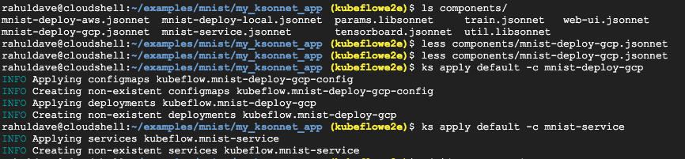
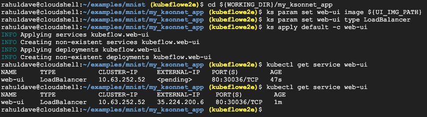
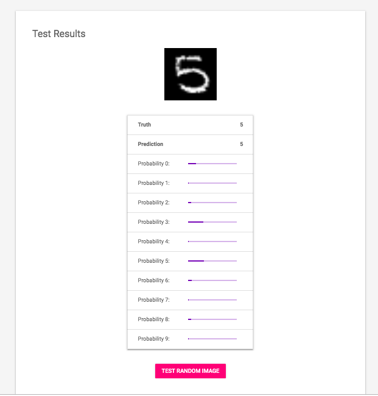

# End to End Kubeflow

------

This tutorial is a heavily edited version of <https://www.kubeflow.org/docs/gke/gcp-e2e/>.

## 1. Set up ksonnet app and model


1. We first need to set up a project in GCP. Create a project called `kubeflowe2e` in the GCP console. This will create a project-id that looks something like `kubeflowe2e-238505`. Make sure that billing is enabled for your project. ————>Also make sure you use the zone `us-central1 ` for the purposes of this tutorial.
2. Also choose a name for your `app`. We'll call it `myapp`. Remember this for now.
3. Go to the following pages on the GCP Console and ensure that the specified APIs are enabled on your GCP account:
   - [Compute Engine API](https://console.cloud.google.com/apis/library/compute.googleapis.com)
   - [GKE API](https://console.cloud.google.com/apis/library/container.googleapis.com)
   - [Identity and Access Management (IAM) API](https://console.cloud.google.com/apis/library/iam.googleapis.com)
   - [Deployment Manager API](https://console.cloud.google.com/apis/library/deploymentmanager.googleapis.com)

## 2. IAP


3. The next step is to set up an OAuth Credential to use a [Cloud Identity-Aware Proxy (Cloud IAP)](https://cloud.google.com/iap/docs/) . To do this, first

   1. Set up your OAuth [consent screen](https://console.cloud.google.com/apis/credentials/consent). For **Application Name** use `myapp`, for **support email**, use the email you used to set up GCP. For **Authorized Domain** use `<project-id>.cloud.goog`. The project-id will be of the form `kubeflowe2e-238505`, that is your preject name followed by a number. Now click **Save**.

   2. Move over to the [credentials tab](https://console.cloud.google.com/apis/credentials) (it is to the left of the current screen in the current web page).

      1. Click **Create credentials**, and then click **OAuth client ID**.
      2. Under **Application type**, select **Web application**.
      3. In the **Name** box enter any name for your OAuth client ID. This is *not* the name of your application nor the name of your Kubeflow deployment. It’s just a way to help you identify the OAuth client ID.
      4. In the **Authorized redirect URIs** box, enter the following: `https://<app>.endpoints.<project-id>.cloud.goog/_gcp_gatekeeper/authenticate`. In place of `<app>` use `myapp` and for `<project-id>` use your project-id which will look something like this: `kubeflowe2e-238505`. For this example the endpoint will end up looking like `https://myapp.endpoints.kubeflowe2e-238505.cloud.goog/_gcp_gatekeeper/authenticate`
      5. Press **Enter/Return** to add the URI. Check that the URI now appears as a confirmed item under **Authorized redirect URIs**. (It should no longer be editable.)
      6. Make note of the **client ID** and **client secret** that appear in the OAuth client window. You need them later to enable Cloud IAP.

      

      ## 3. Deploy using UI

   taken from [here](https://www.kubeflow.org/docs/gke/deploy/deploy-ui/)

   1. Open [https://deploy.kubeflow.cloud/](https://deploy.kubeflow.cloud/#/deploy) in your web browser.
   2. Sign in using a GCP account that has administrator privileges for your GCP project.
   3. Complete the form, following the instructions on the left side of the form. In particular, ensure that you enter the same **deployment name** as you used when creating the OAuth client ID.
   4. Check **Skip IAP** box if you want to use basic auth.
   5. Click **Create Deployment**.

   Kubeflow will be available at the following URI:

   ```
   https://<app>.endpoints.<project-id>.cloud.goog/
   ```

   In our case here it would look like `https://myapp.endpoints.kubeflowe2e-238505.cloud.goog/`. It can take 10-15 minutes for the URI to become available. 

   You can watch for updates in the information box on the deployment UI. If the deployment takes longer than expected, try accessing the above URI anyway.


Take a look around the UI. 

## 4. Set up ksonnet app and model

In the cloud shell, you may need to run the command `source setup.sh`. You will need to do this any time you reconnect to the cloud shell.

 Lets clone down the code for our model

```bash
git clone https://github.com/kubeflow/examples.git
cd examples/mnist
export WORKING_DIR=$(pwd)
export KS_NAME="my_ksonnet_app"
```

Add the last 3 lines to a file, model.sh:

```bash
cd ~/examples/mnist
export WORKING_DIR=$(pwd)
export KS_NAME="my_ksonnet_app"
```

Then run `source model.sh`. This should leave you in `~/examples/mnist`.

Take a look at `model.py` in `examples/mnist`. This is the model we'll be running.

Now we'll set up a `ksonnet` app. From the `WORKING_DIR` do the following:

```bash
ks init ${KS_NAME}
cd ${KS_NAME}
cp -a ${WORKING_DIR}/ks_app/components/* ${WORKING_DIR}/${KS_NAME}/components/
ks registry add kubeflow github.com/kubeflow/kubeflow/tree/${KUBEFLOW_VERSION}/kubeflow
ks pkg install kubeflow/tf-serving@${KUBEFLOW_VERSION}

```

This sets up our `ksonnet` app and installs the tensorflow serving package as well.

## 2. Docker our model and set params


(1) **Docker Build**: We'll run the following docker build code:

```bash
export VERSION_TAG=$(date +%s)
export TRAIN_IMG_PATH=gcr.io/${PROJECT}/${DEPLOYMENT_NAME}-train:${VERSION_TAG}
docker build $WORKING_DIR -t $TRAIN_IMG_PATH -f $WORKING_DIR/Dockerfile.model
```

Read `Dockerfile.model` to see how the container is run. Lets test it locally on our google cloud shell.

```bash
docker run -it ${TRAIN_IMG_PATH}
```

CTRL-C to get out of this (rather slow) training loop.

Now we need to upload our image to the google container registry. Authenticate, then push

```bash
gcloud auth configure-docker --quiet
docker push ${TRAIN_IMG_PATH}
```

Wait until the process is complete, then you should see your new container image listed on the [Container Registry page](https://console.cloud.google.com/gcr) on the GCP console.

(2) **Param Setting**: Now we need to set some `ksonnet` params to have our model running on the cluster:

```bash
ks param set train name "train-"${VERSION_TAG}
ks param set train image ${TRAIN_IMG_PATH}
ks param set train modelDir "gs://"${BUCKET_NAME}
ks param set train exportDir "gs://"${BUCKET_NAME}/export
ks param list train
```

The last command lists the params.

 You need to ensure that your Python code has the required permissions to read/write to your Cloud Storage bucket. Kubeflow solves this by creating a [service account](https://cloud.google.com/iam/docs/understanding-service-accounts) within your project as a part of the deployment. You can verify this by listing your service accounts:

```bash
gcloud iam service-accounts list | grep ${DEPLOYMENT_NAME}
```

Kubeflow granted this service account the right permissions to read and write to your storage bucket. Kubeflow also added a [Kubernetes secret](https://kubernetes.io/docs/concepts/configuration/secret/) named `user-gcp-sa` to your cluster, containing the credentials needed to authenticate as this service account within the cluster:

```bash
kubectl describe secret user-gcp-sa
```

To access your storage bucket from inside the `train` container, you must set the [GOOGLE_APPLICATION_CREDENTIALS](https://cloud.google.com/docs/authentication/getting-started) environment variable to point to the JSON file contained in the secret. Set the variable by passing the following parameters to the `train.jsonnet` component:

```bash
ks param set train secret user-gcp-sa=/var/secrets
ks param set train envVariables GOOGLE_APPLICATION_CREDENTIALS=/var/secrets/user-gcp-sa.json
```

## 3. Train Train Train (finally!)

[Apply](https://github.com/ksonnet/ksonnet/blob/master/docs/cli-reference/ks_apply.md) the container to the cluster. The following ksonnet command applies the container in the `default` [ksonnet environment](https://github.com/ksonnet/ksonnet/blob/master/docs/concepts.md#environment), because the downloaded sample provides only the default environment:

```bash
ks apply default -c train
```

When the command finishes running, there should be a new workload on the cluster, with a name like `train-<VERSION_TAG>-chief-0`.

You can see the workloads on the [GKE Workloads page](https://console.cloud.google.com/kubernetes/workload) on the GCP console. To see the logs, click the workload, then click **Container logs**.

When training is complete, you should see the model data pushed into your Cloud Storage bucket, tagged with the same version number as the container that generated it. To explore, click your bucket name on the [Cloud Storage page](https://console.cloud.google.com/storage) on the GCP Console.

Typically you will want to do many runs after changing things. Not talking here about hyperparameter optimization (more on that soon). For that, build a new image with a new version tag and a new path, and then do something like:

```bash
ks param set train name "train-"${VERSION_TAG}
ks param set train image ${TRAIN_IMG_PATH}
#Delete and re-apply the component to the cluster with the following commands:

ks delete default -c train
ks apply default -c train
```

## 4. Serve and UI your model

(1) Lets serve our model tensorflow-serving!

Look at the components in your `${WORKING_DIR}/my_ksonnet_app/components` directory. The relevant configuration files in that directory are `mnist-deploy-gcp.jsonnet` and `mnist-service.jsonnet`.



Let us set up some parameters in `ksonnet` and [apply](https://github.com/ksonnet/ksonnet/blob/master/docs/cli-reference/ks_apply.md) the component to the cluster:

```bash
ks param set mnist-deploy-gcp modelBasePath "gs://"${BUCKET_NAME}/export
ks param set mnist-deploy-gcp modelName mnist
ks apply default -c mnist-deploy-gcp
ks apply default -c mnist-service
```

There should now be a new workload on the cluster, with the name `mnist-deploy-gcp`. You can see the **mnist-service** service on the [GKE Services page](https://console.cloud.google.com/kubernetes/discovery). If you click through to see the service details, you can see that it listens for connections within the cluster on port 9000.

(2) What if we want a UI? We'll need to deploy this. The workflow we'll use is similar to our training workflow. Our code gets wrapped into a docker image which is then scheduled onto a pod on our kubernetes cluster. The web UI code is stored in the `${WORKING_DIR}/web-ui` directory, with a dockerfile to build an appropriate image

```bash
cd ${WORKING_DIR}
export UI_IMG_PATH=gcr.io/${PROJECT}/${DEPLOYMENT_NAME}-web-ui
docker build ${WORKING_DIR}/web-ui -t ${UI_IMG_PATH}
docker push ${UI_IMG_PATH}
```

```bash
cd ${WORKING_DIR}/my_ksonnet_app
ks param set web-ui image ${UI_IMG_PATH}
ks param set web-ui type LoadBalancer
ks apply default -c web-ui
```



As you see we need to set params on the `ksonnet` app and apply it to the cluster. You can see the **web-ui** entry on the [GKE Workloads page](https://console.cloud.google.com/kubernetes/workload) and on the [Services page](https://console.cloud.google.com/kubernetes/discovery).

1. Find the IP address assigned to the service:

   ```bash
   kubectl get service web-ui
   ```

2. Copy the value shown under `EXTERNAL-IP` and paste it into your web browser’s address bar. The web UI should appear.

   

## 5. Clean up and dont incur costs!

Run the following command to delete your deployment and related resources:

```bash
gcloud deployment-manager --project=${PROJECT} deployments delete ${DEPLOYMENT_NAME}
```

Delete your Cloud Storage bucket when you’ve finished with it:

```bash
gsutil rm -r gs://${BUCKET_NAME}
```

Delete the container images uploaded to Container Registry:

```bash
// Find the digest id for each container image:
gcloud container images list-tags us.gcr.io/$PROJECT/kubeflow-train
gcloud container images list-tags us.gcr.io/$PROJECT/kubeflow-web-ui

// Delete each image:
gcloud container images delete us.gcr.io/$PROJECT/kubeflow-web-ui:$DIGEST_ID
gcloud container images delete us.gcr.io/$PROJECT/kubeflow-train:$DIGEST_ID
```

As an alternative to the command line, you can delete the various resources using the [GCP Console](https://console.cloud.google.com/cloud-resource-manager).