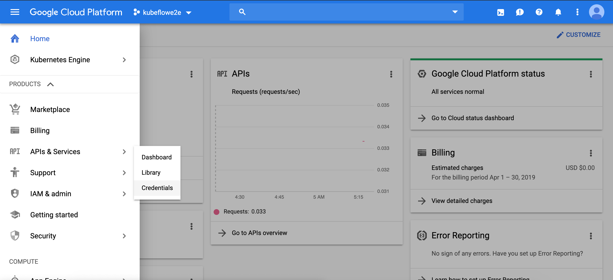
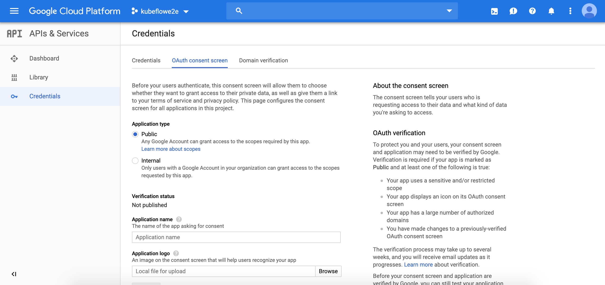
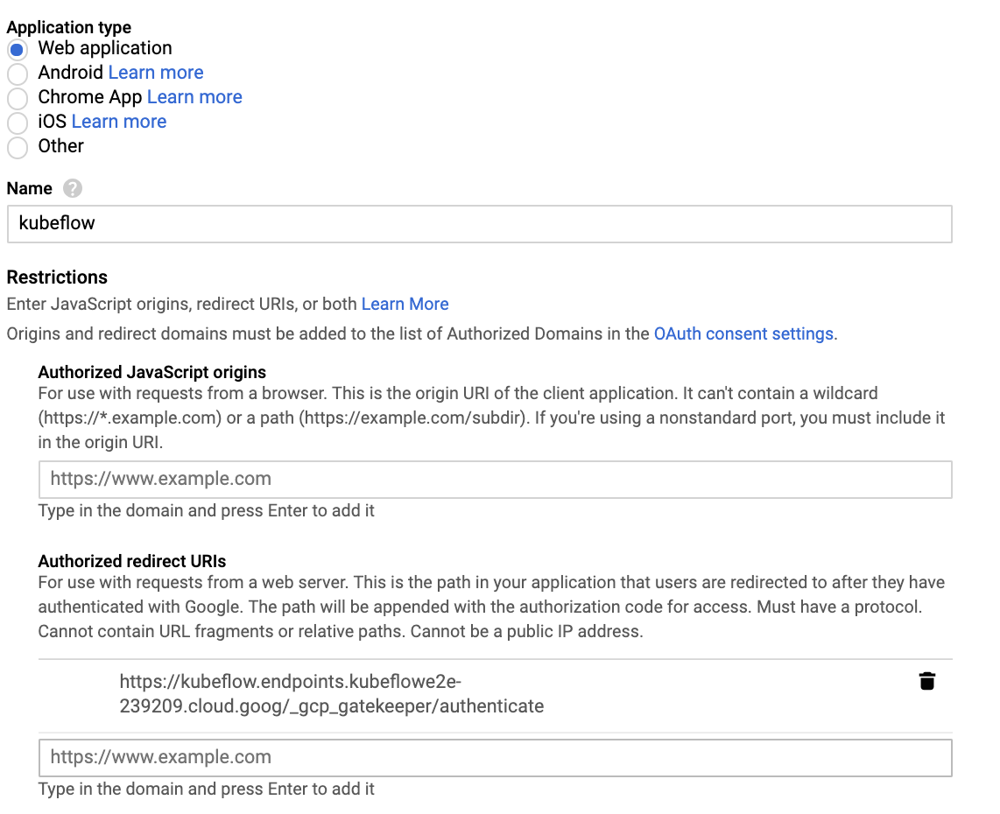

# Kubeflow and ksonnet Setup

---

This tutorial is a heavily edited version of <https://www.kubeflow.org/docs/gke/gcp-e2e/>. The deployment aspects for GCP are taken from [here](https://www.kubeflow.org/docs/gke/deploy/).

## 1. Create a new GCP project

1. We first need to set up a new project in GCP. Create a project called `kubeflowe2e` in the GCP console. This will create a project-id that looks something like `kubeflowe2e-238505`. Make sure that billing is enabled for your project.

2. Ensure that the specified APIs are enabled on this new project:
   - [GKE API](https://console.cloud.google.com/apis/library/container.googleapis.com)
   - [Deployment Manager API](https://console.cloud.google.com/apis/library/deploymentmanager.googleapis.com)

## 2. Set up OAuth Credential

The next step is to set up an OAuth Credential to use a [Cloud Identity-Aware Proxy (Cloud IAP)](https://cloud.google.com/iap/docs/) .

1. Click on the navigation toggle button, and scroll down the navigation menu to **API & Services** and click on **Credentials**.



2. Select OAuth Credential tab



For **Application Name** use `myapp`, for **support email**, use the email you used to set up GCP. For **Authorized Domain** use `<project-id>.cloud.goog`. The project-id will be of the form `kubeflowe2e-238505`, that is your preject name followed by a number. Now click **Save**.

3. On clicking Save, you will move back to the Credentials tab.

   1. Click **Create credentials**, and then click **OAuth client ID**.
   2. Under **Application type**, select **Web application**.
   3. In the **Name** box enter any name for your OAuth client ID. This is _not_ the name of your application nor the name of your Kubeflow deployment. It’s just a way to help you identify the OAuth client ID.
   4. In the **Authorized redirect URIs** box, enter the following: `https://<app>.endpoints.<project-id>.cloud.goog/_gcp_gatekeeper/authenticate`. In place of `<app>` use `myapp` and for `<project-id>` use your project-id which will look something like this: `kubeflowe2e-238505`. For this example the endpoint will end up looking like `https://kubeflow.endpoints.kubeflowe2e-238505.cloud.goog/_gcp_gatekeeper/authenticate`
   5. Press **Enter/Return** to add the URI. Check that the URI now appears as a confirmed item under **Authorized redirect URIs**. (It should no longer be editable.)



4. Make note of the **client ID** and **client secret** that appear in the OAuth client window. You need them later to enable Cloud IAP.

## 3. Deploy using UI


taken from [here](https://www.kubeflow.org/docs/gke/deploy/deploy-ui/)

1.  Open [https://deploy.kubeflow.cloud/](https://deploy.kubeflow.cloud/#/deploy) in your web browser.
2.  Sign in using a GCP account that has administrator privileges for your GCP project.
3.  Complete the form, following the instructions on the left side of the form. In particular, ensure that you enter the same **deployment name** as you used when creating the OAuth client ID.
4.  Click **Create Deployment**.

This will take approximately 20 minutes to complete.

Kubeflow dashboard will be available at the following URI:

```
https://<deployment-name>.endpoints.<project-id>.cloud.goog/
```

In our case, it will look like `https://kubeflow.endpoints.kubeflowe2e-238505.cloud.goog/`.

You can watch for updates in the information box on the deployment UI. If the deployment takes longer than expected, try accessing the above URI anyway.

Take a look around the UI.


When the cluster is ready, you can do the following in Cloud Shell:

1. Connect your local `kubectl` session to the cluster:

   `$ gcloud container clusters get-credentials <deployment-name> --zone us-central1-a --project <project-id>`

2. Switch to the `kubeflow` namespace to see the resources on the Kubeflow cluster:

   `$ kubectl config set-context $(kubectl config current-context) --namespace=kubeflow`

3. Check the resources deployed in the `kubeflow` namespace:

   `$ kubectl get all`

## 4. Set up ksonnet and storage

[ksonnet](https://ksonnet.io/) is a framework for writing, sharing, and deploying Kubernetes application manifests.

1. Run the following lines in Cloud Shell:

```bash
export KS_VER=0.13.1
export KS_PKG=ks_${KS_VER}_linux_amd64
wget -O /tmp/${KS_PKG}.tar.gz https://github.com/ksonnet/ksonnet/releases/download/v${KS_VER}/${KS_PKG}.tar.gz
tar -xvf /tmp/$KS_PKG.tar.gz -C ${HOME}/local/bin
alias ks="~/local/bin/$KS_PKG/ks"
```

This will set up a command `ks` which is a helm-like software `ksonnet` to administer Kubernetes clusters.

2. Now let us set up several environment variables to help us:

Put the following code in a file `setup.sh` (replace the stuff between angled brackets by the appropriate variables):

```bash
export KFAPP="<deployement-name>"
export ZONE="<zone-from-gui>"
export CLIENT_ID="<client-id>"
export CLIENT_SECRET="<client-secret>"
export KS_VER=0.13.1
export KS_PKG=ks_${KS_VER}_linux_amd64
alias ks="~/local/bin/$KS_PKG/ks"
export DEPLOYMENT_NAME=$KFAPP
#For the next line you could do
#export PROJECT="<project-id>"
export PROJECT=${DEVSHELL_PROJECT_ID}
export KUBEFLOW_VERSION="v0.5-branch"
export BUCKET_NAME=${PROJECT}-${DEPLOYMENT_NAME}-bucket
```

Then, in Cloud Shell run the command `source setup.sh`. You will need to do this any time you reconnect to the cloud shell.

3. We'll create a storage bucket. Type: `gsutil mb -c regional -l us-central1 gs://${BUCKET_NAME}` .This will create us a google storage bucket.


## FIN. Destroying it all

See the end to end example for this tutorial. But generally you must kill your deployment, storage buckets, and reclaim space for any registry images you created!

Run the following command to delete your deployment and related resources:

```bash
gcloud deployment-manager --project=${PROJECT} deployments delete ${DEPLOYMENT_NAME}
```

Delete your Cloud Storage bucket when you’ve finished with it:

```bash
gsutil rm -r gs://${BUCKET_NAME}
```
