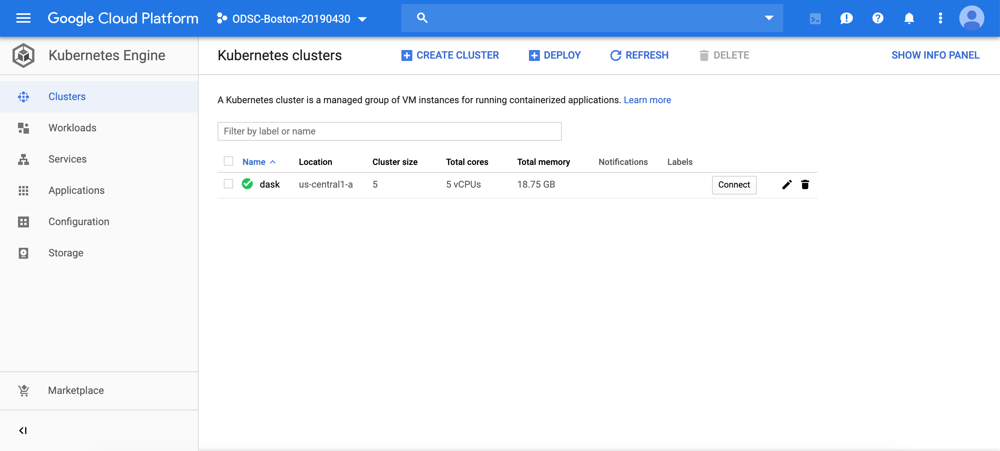
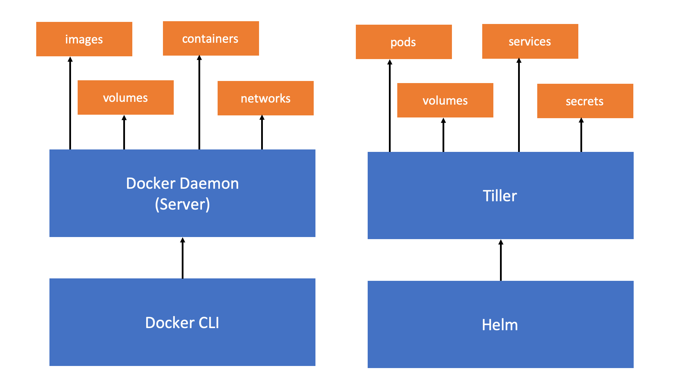
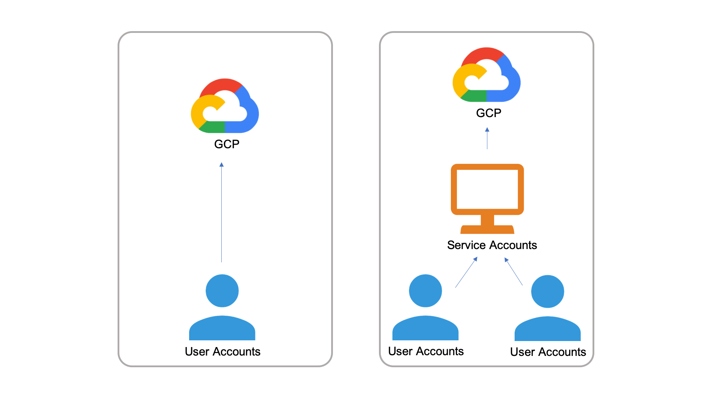
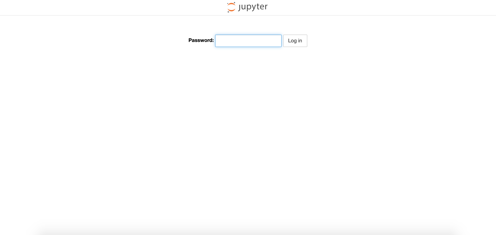
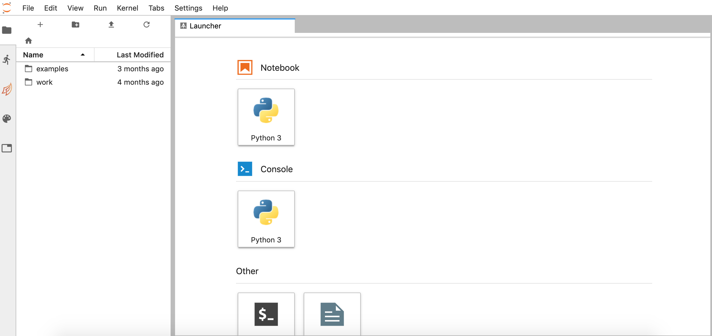
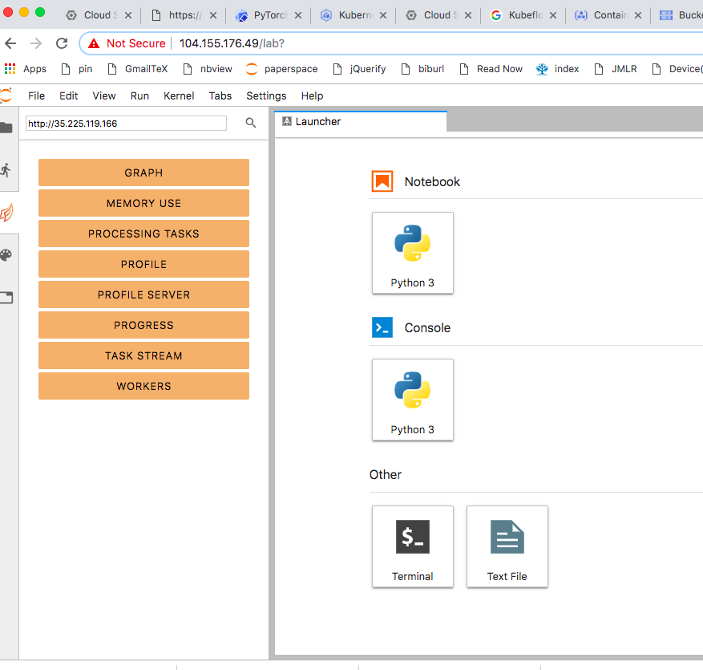

# Deploying Dask on Google Kubernetes Engine

In this section , we install Dask in a Kubernetes cluster in GKE using Helm, a popular Kubernetes package manager.

## Create new Kubernetes cluster

In the last section, we used Cloud Console's browser interface to create a Kubernetes cluster. Here, we will use `gcloud` command-line tool in Cloud Shell.

In Google Cloud Shell, use the following gcloud command:

```bash
$ gcloud container clusters create dask \
                                  --zone us-central1-a \
                                  --machine-type n1-standard-1 \
                                  --num-nodes 5
```

This command creates a new Kubernetes cluster named `dask` in `us-central1-a` zone with 5 instances of `n1-standard-1` Machine type. This cluster will have 5 virtual CPUs and 18.75 GB of memory.

It may take 2-3 minutes to complete.



---

# What is Helm?

Helm is a popular Kubernetes package manager currently maintained by the Cloud Native Computing Foundation (CNCF). Helm has become popular with Kubernetes developers because it simplifies Kubernetes application management, the roll out of updates, and options to share applications.

Helm packages are called _charts_, which are similar to _images_ in Docker. Similarly, just as Docker has Docker Hub, which is a centralized library of Docker images, Helm has [Helm Hub](https://hub.helm.sh/), which has hundreds of charts ready for deployment.

---

# Setting up Helm (and Tiller) in GCP

Helm is not included as one of `gcloud` utilities like `kubectl`. You will need to manually install Helm in GCP, and this involves a few steps that requires introductions of new concepts including Role Based Access Control (RBAC) and Service Accounts.

For now, installing Helm in Google Cloud requires us use an installer script provided by Helm maintainers. In the Cloud Shell, run the following command:

`$ curl -L https://git.io/get_helm.sh | bash`

Helm comes in two parts -- Helm and Tiller. Tiller is the backend services that communicated with Kubernetes API to administer Helm packages in Kubernetes clusters. Just as the Docker Engine has two components, the Docker CLI and the Docker Daemon, which listens for API requests and manages Docker objects such as images, containers, networks, and volumes, Helm comes with Helm CLI and Tiller.

Figure below maps the relationship between Helm and Tiller and its counterpart in Docker.



---

## Role Based Access Control

Role Based Access Control (RBAC) is a mechanism in computer security to restrict system access to unauthorized users. Most cloud computing providers including Google has RBAC enabled. In order to giver Tiller the access to administer Kubernetes cluster, you must create a service account with administrative role and assign the service account to Tiller.

### So what's service account?

We typically use cloud computing resources as individual users using user accounts. User accounts identifies a _person_ administering a cluster. On the other hand, service accounts, in the context of Kubernetes, identifies a _pod_ administering a cluster. Once a service account is given an administrative role to manage a cluster, than any user with access to the service account can control the cluster indirectly.



### Rolebinding

Service accounts are given access privileges through role binding, which is another new concept that requires an introduction.

- ClusterRoleBinding: Grants a ClusterRole across the entire cluster, including all namespaces

  - `cluster-admin` - When used in a ClusterRoleBinding, it gives super-user access over every resource in the cluster and in all namespaces. When used in a RoleBinding, it gives super-user access over every resource in the rolebinding's namespace, including the namespace itself.

- RoleBinding: Grants a Role or ClusterRole within a specific namespace

  - `admin` - Allows admin/read/write access to most resources in a namespace, including the ability to create roles and rolebindings within the namespace. It does not allow write access to resource quota or to the namespace itself.

  - `edit` - Allows read/write access to most objects in a namespace. It does not allow viewing or modifying roles or rolebindings.

  - `view` - Allows read-only access to see most objects in a namespace. It does not allow viewing roles or rolebindings. It does not allow viewing secrets, since those are escalating.

---

## Setting up Helm (and Tiller) Cont'd

Finally, coming back to the setting up Helm and Tiller, the next step is to create a new service account called `tiller` by running:

`$ kubectl --namespace kube-system create serviceaccount tiller`

Assign ClusterRoleBinding to the `tiller` service account.

`$ kubectl create clusterrolebinding tiller --clusterrole cluster-admin --serviceaccount=kube-system:tiller`

Finally, initialize Helm and Tiller by

`$ helm init --service-account tiller`

To check that Helm and Tiller has been initialized correction, use the following command:

`$ helm version`

You should see an output that looks something like this:

```
Client: &version.Version{SemVer:"v2.13.1", GitCommit:"618447cbf203d147601b4b9bd7f8c37a5d39fbb4", GitTreeState:"clean"}
Server: &version.Version{SemVer:"v2.13.1", GitCommit:"618447cbf203d147601b4b9bd7f8c37a5d39fbb4", GitTreeState:"clean"}
```

Usually you will secure your Tiller server in order to prevent unauthorized installation or removal of containers in your Kubernetes cluster. This requires adding [Transporting Layer Security](https://en.wikipedia.org/wiki/Transport_Layer_Security) in your installation of Helm and Tiller; however, this is beyond the scope of this tutorial. We refer you to [Helm documentation](https://helm.sh/docs/using_helm/#securing-your-helm-installation) and this useful article: [Install Secure Helm In Google Kubernetes Engine (GKE)](https://medium.com/google-cloud/install-secure-helm-in-gke-254d520061f7).

---

## Installing Dask using Helm

Now that you set up Helm in your Kubernetes cluster, you are ready to install Dask. First perform an update to get the latest list of charts:

`$ helm repo update`

Install Dask chart on Kubernetes cluster

`$ helm install --name dask stable/dask`

This installs three Deployment workloads in the cluster: `dask-jupyter`, `dask-scheduler`, and `dask-worker`. This step will take a few minutes to complete.


Run `$ kubectl get pods` in the Cloud Shell, and your output should look something like this:

```
NAME                              READY     STATUS    RESTARTS   AGE
dask-jupyter-698b5d99bc-7lh5x     1/1       Running   0          7m
dask-scheduler-7dc8b8bb6c-45q7t   1/1       Running   0          7m
dask-worker-77679f5c67-2cxcl      1/1       Running   0          7m
dask-worker-77679f5c67-2gbxr      1/1       Running   0          7m
dask-worker-77679f5c67-2nxcn      1/1       Running   0          7m
```

Let's add custom changes to include additional Python libraries such as `keras` and `dask_ml`. Here is the `config.yaml` we use:

```yaml
worker:
  env:
    - name: EXTRA_PIP_PACKAGES
      value: dask-ml tensorflow keras --upgrade

# We want to keep the same packages on the worker and jupyter environments
jupyter:
  enabled: true
  env:
    - name: EXTRA_PIP_PACKAGES
      value: dask-ml tensorflow keras --upgrade
```

We use this to upgrade our helm install

`$ helm upgrade dask stable/dask -f dask_material/config.yaml`

---

## Using Jupyter Lab with Dask

Run `$ kubectl get services`

This command will output

```
NAME             TYPE           CLUSTER-IP      EXTERNAL-IP      PORT(S)                       AGE
dask-jupyter     LoadBalancer   10.15.249.144   35.238.137.198   80:31763/TCP                  9m
dask-scheduler   LoadBalancer   10.15.240.208   35.232.63.205    8786:32087/TCP,80:32099/TCP   9m
kubernetes       ClusterIP      10.15.240.1     <none>           443/TCP                       28m
```

Copy the `EXTERNAL-IP` address of dask-jupyter LoadBalancer and visit this IP address
on a new browser window. This will open up Jupyter Lab's authentication page.



The default password is `dask`. This will take you to Jupyter Lab workspace.



---

You can get the dask dashboard running using `http://dask-scheduler-external-ip` in the search bar in the upper left-corner:



---

# Cleaning Up

Delete the Dask chart by using the following command in the Cloud Shell:

```
helm delete dask --purge
```

Don't forget to also delete the Kubernetes cluster.

```
gcloud container clusters delete dask
```

---

## Resources

Here are some additional resources for Dask:

- [Dask Documentation](https://docs.dask.org/en/latest/)
- [Dask Tutorial (Github)](https://github.com/dask/dask-tutorial)
- [Dask Tutorial (Youtube)](https://www.youtube.com/watch?v=mbfsog3e5DA)

For Helm:

- [Helm Documentation](https://helm.sh/docs/)
- [How To Create Your First Helm Chart](https://docs.bitnami.com/kubernetes/how-to/create-your-first-helm-chart/)
