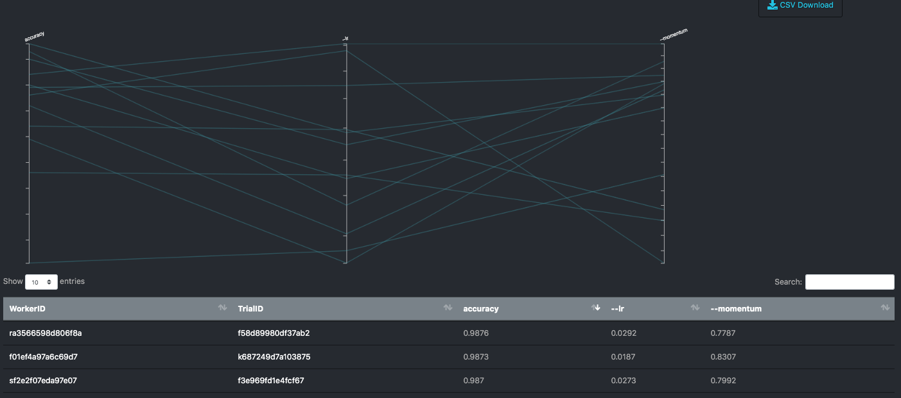

# Kubeflow Katib

Inspired by Google's Vizier, Kubeflow has a piece of software called Katib for hyperparameter optimization.

Its a great example of the basic concepts behind Kubeflow. We'll use the distributed PyTorch operator as an example. See <https://github.com/kubeflow/pytorch-operator/>.

The pytorch-operator is installed for you by the kubeflow install, so its relatively easy to run a pytorch katib job. With our install of kubeflow, run the following at the cloud shell:

```bash
kubectl create -f https://raw.githubusercontent.com/kubeflow/katib/master/examples/v1alpha1/pytorchjob-example.yaml
```

How does this work? Its quite simple, really, the yaml file specifies how we are going to run over the hyperparameters:

```yaml
apiVersion: "kubeflow.org/v1alpha1"
kind: StudyJob
metadata:
  namespace: kubeflow
  labels:
    controller-tools.k8s.io: "1.0"
  name: pytorchjob-example
spec:
  studyName: pytorchjob-example
  owner: crd
  optimizationtype: maximize
  objectivevaluename: accuracy
  optimizationgoal: 0.99
  requestcount: 4
  metricsnames:
    - accuracy
  parameterconfigs:
    - name: --lr
      parametertype: double
      feasible:
        min: "0.01"
        max: "0.05"
    - name: --momentum
      parametertype: double
      feasible:
        min: "0.5"
        max: "0.9"
  workerSpec:
    retain: true
    goTemplate:
        rawTemplate: |-
          apiVersion: "kubeflow.org/v1beta1"
          kind: PyTorchJob
          metadata:
            name: {{.WorkerID}}
            namespace: kubeflow
          spec:
           pytorchReplicaSpecs:
            Master:
              replicas: 1
              restartPolicy: OnFailure
              template:
                spec:
                  containers:
                    - name: pytorch
                      image: gcr.io/kubeflow-ci/pytorch-dist-mnist-test:v1.0
                      imagePullPolicy: Always
                      command:
                        - "python"
                        - "/var/mnist.py"
                        {{- with .HyperParameters}}
                        {{- range .}}
                        - "{{.Name}}={{.Value}}"
                        {{- end}}
                        {{- end}}
            Worker:
              replicas: 2
              restartPolicy: OnFailure
              template:
                spec:
                  containers:
                    - name: pytorch
                      image: gcr.io/kubeflow-ci/pytorch-dist-mnist-test:v1.0
                      imagePullPolicy: Always
                      command:
                        - "python"
                        - "/var/mnist.py"
                        {{- with .HyperParameters}}
                        {{- range .}}
                        - "{{.Name}}={{.Value}}"
                        {{- end}}
                        {{- end}}
  suggestionSpec:
    suggestionAlgorithm: "random"
    requestNumber: 3
```

Notice here we are doing a random search, in a certain momentum/learning-rate space, with each job implementing distributed training with 1 master and 2 workers. Notice that **everything** runs `var/mnist.py` with the following docker container `pytorch-dist-mnist-test:v1.0`.

The build for the docker container and th mnist training code can be found in the repository for the `pytorch operator` in kubeflow at <https://github.com/kubeflow/pytorch-operator/>. Specifically, lets go to <https://github.com/kubeflow/pytorch-operator/tree/master/examples/mnist> where we find the appropriate `Dockerfile`:

```dockerfile
FROM pytorch/pytorch:1.0-cuda10.0-cudnn7-runtime

RUN pip install tensorboardX==1.6.0
WORKDIR /var
ADD mnist.py /var

ENTRYPOINT ["python", "/var/mnist.py"]
```

and the appropriate code from `mnist.py`

```python
model = Net().to(device)

if is_distributed():
    Distributor = nn.parallel.DistributedDataParallel if use_cuda else nn.parallel.DistributedDataParallelCPU
    model = Distributor(model)

optimizer = optim.SGD(model.parameters(), lr=args.lr,  momentum=args.momentum)

for epoch in range(1, args.epochs + 1):
    train(args, model, device, train_loader, optimizer, epoch, writer)
    test(args, model, device, test_loader, writer, epoch)

if (args.save_model):
    torch.save(model.state_dict(),"mnist_cnn.pt")
```




