autoscale: true

#[fit]Performantly Scaling
#[fit]Machine Learning

## Rahul Dave, `univ.ai`
## Richard Kim, `markovlabs`

---


## What is scaling?

- Running experiments reproducibly, and keeping track
- Running in parallel, for speed and resilience
- Dealing with large data sets
- Grid or other Hyper-parameter optimization
- optimizing Gradient Descent

---

## Whats available in the market

- sagemager
- google
- neptune.io
- weights and biases, etc

---

## Hyper-parameter optimization

Eg, **Gradient boosting**: The basic idea is to fit the residuals of tree based regression models again and again. Peter Prettenhofer, who wrote sklearns GBRT implementation writes in his pydata14 talk:

>*I usually follow this recipe to tune the hyperparameters*:

- Pick `n_estimators` as large as (computationally) possible (e.g. 3000)
- Tune `max_depth/min_samples_leaf`, `learning_rate`, and `max_features` via grid search
- A lower `learning_rate` requires a higher number of `n_estimators`. Thus increase `n_estimators` even more and tune `learning_rate` again holding the other params fixed. 

---


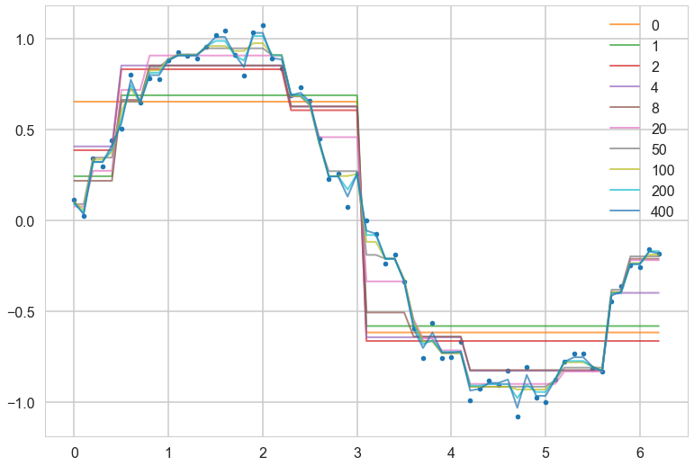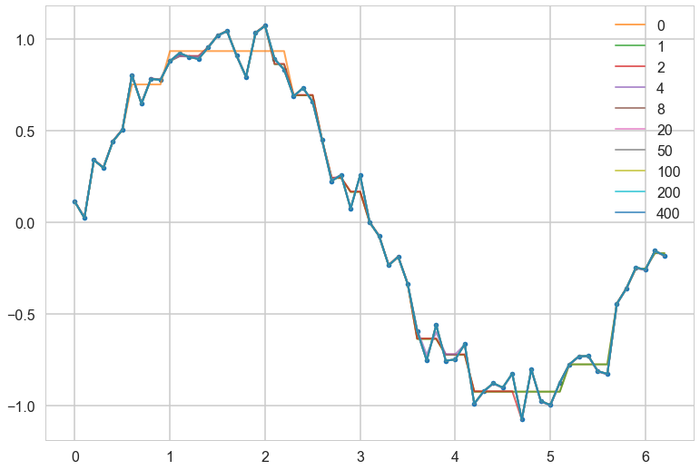

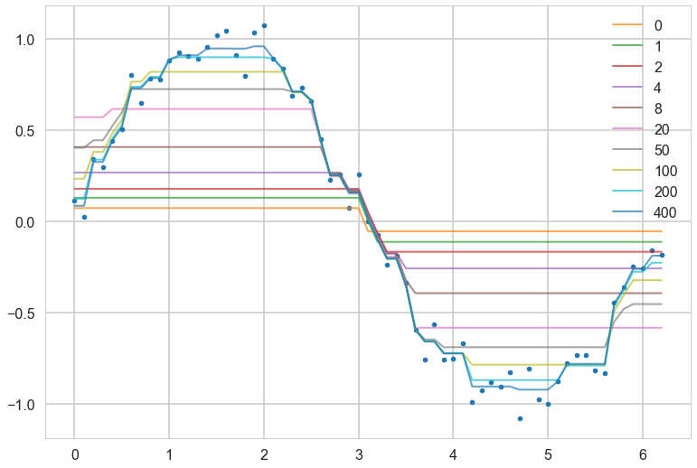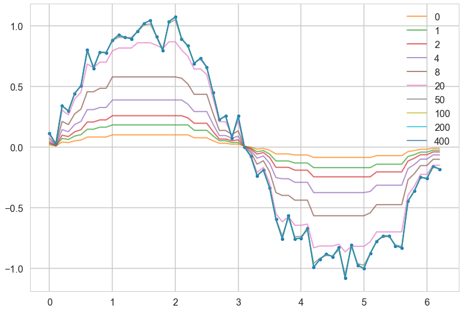

---

# Why is this bad?

```python
from sklearn.model_selection import GridSearchCV

vectorizer = TfidfVectorizer()
vectorizer.fit(text_train)

X_train = vectorizer.transform(text_train)
X_test = vectorizer.transform(text_test)

clf = LogisticRegression()
grid = GridSearchCV(clf, param_grid={'C': [.1, 1, 10, 100]}, cv=5)
grid.fit(X_train, y_train)
```

---

## Grid search on pipelines

```python
from sklearn.feature_extraction.text import CountVectorizer, TfidfTransformer
from sklearn.linear_model import SGDClassifier
from sklearn.pipeline import Pipeline
from sklearn.model_selection import GridSearchCV
from sklearn.datasets import fetch_20newsgroups

categories = [
    'alt.atheism',
    'talk.religion.misc',
]
data = fetch_20newsgroups(subset='train', categories=categories)
pipeline = Pipeline([('vect', CountVectorizer()),
                     ('tfidf', TfidfTransformer()),
                     ('clf', SGDClassifier())])
grid = {'vect__ngram_range': [(1, 1)],
        'tfidf__norm': ['l1', 'l2'],
        'clf__alpha': [1e-3, 1e-4, 1e-5]}

if __name__=='__main__':
    grid_search = GridSearchCV(pipeline, grid, cv=5, n_jobs=-1)
    grid_search.fit(data.data, data.target)
    print("Best score: %0.3f" % grid_search.best_score_)
    print("Best parameters set:", grid_search.best_estimator_.get_params())
```

---

From [sklearn.pipeline.Pipeline.html](https://scikit-learn.org/stable/modules/generated/sklearn.pipeline.Pipeline.html) :

*Sequentially apply a list of transforms and a final estimator. Intermediate steps of the pipeline must be ‘transforms’, that is, they must implement `fit` and `transform` methods. The final estimator only needs to implement `fit`. The transformers in the pipeline can be cached using memory argument.*

**The purpose of the pipeline is to assemble several steps that can be cross-validated together while setting different parameters.**


---

## sklearn pipelines: the bad

```python
scores = []
for ngram_range in parameters['vect__ngram_range']:
        for norm in parameters['tfidf__norm']:
                for alpha in parameters['clf__alpha']:
                        vect = CountVectorizer(ngram_range=ngram_range)
                        X2 = vect.fit_transform(X, y)
                        tfidf = TfidfTransformer(norm=norm)
                        X3 = tfidf.fit_transform(X2, y)
                        clf = SGDClassifier(alpha=alpha)
                        clf.fit(X3, y)
                        scores.append(clf.score(X3, y))
best = choose_best_parameters(scores, parameters)
```


---


##ok, so you want todo this

To do it performantly, you will want to make sure you have the 

- same random seed
- same programming environment on multiple machines (ideally same version of OS/python-conda stack/BLAS libraries, etc)
- then run the same code with a different parameter combination on each machine
- deal with the possible loss of some machines in this computation (they die, you got san amazon spot instance..)
- combine all the data output from these runs to make hyperparameter choices

---

## Programming environment: The multiple libraries problem

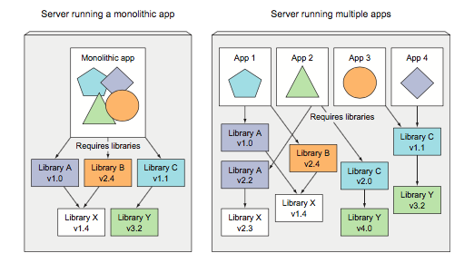

---

## The python part: Conda environments

- create a conda environment for each new project
- put an `environment.yml` in each project folder
- at least have one for each new class, or class of projects
- environment for class of projects may grow organically, but capture its requirements from time-to-time.

see [here](https://conda.io/projects/conda/en/latest/user-guide/tasks/manage-environments.html)

---

```yaml
# file name: environment.yml

# Give your project an informative name
name: project-name

# Specify the conda channels that you wish to grab packages from, in order of priority.
channels:
- defaults
- conda-forge

# Specify the packages that you would like to install inside your environment. 
#Version numbers are allowed, and conda will automatically use its dependency 
#solver to ensure that all packages work with one another.
dependencies:
- python=3.7
- conda
- scipy
- numpy
- pandas
- scikit-learn

# There are some packages which are not conda-installable. You can put the pip dependencies here instead.
- pip:
    - tqdm  # for example only, tqdm is actually available by conda.
```

( from http://ericmjl.com/blog/2018/12/25/conda-hacks-for-data-science-efficiency/)

---

- `conda create --name environment-name [python=3.6]`
- `source[conda] activate environment-name` or project-name in the 1 environment per project paradigm
- `conda env create` in project folder
- `conda install <packagename>`
- or add the package to spec file, type `conda env update environment.yml` in appropriate folder
- `conda env export > environment.yml`

---

## Rest of it: Docker

- More than python libs
- C-library, BLAS, linux kernel, etc
- we could use virtual machines (VMs) like vmware/virtualbox/lvm
- but these are heavy duty, OS level "hypervisor"s
- more general, but resource hungry

---

## Containers vs Virtual Machines

- containers provide process isolation, process throttling
- but work at library and kernel level, and can access hardware more easily
- hardware access important for gpu access
- containers can run on VMS, this is how docker runs on mac, and on many cloud providers. They can also run on a host linux OS on bare metal
  
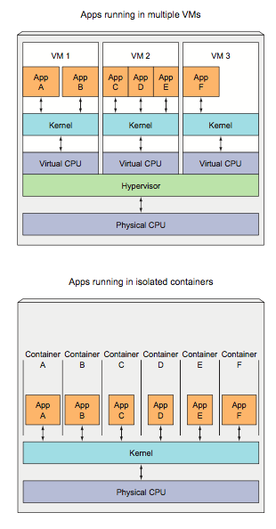

---

## Docker Architecture

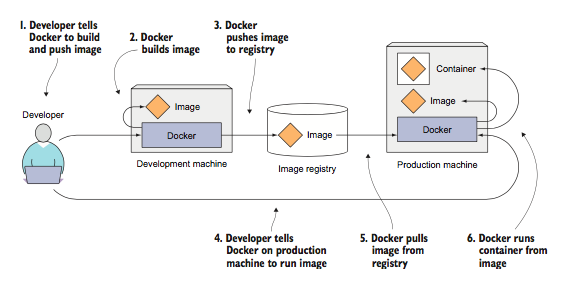

---

## Docker images

- docker is linux only, but other OS's now have support
- allow for environment setting across languages and runtimes
- can be chained together to create outcomes
- base image is a linux (full) image, others are just layers on top
- side benefit: integration testing and testing for CI

---

## An Example

[base notebook](https://github.com/jupyter/docker-stacks/blob/master/base-notebook/Dockerfile) `->` [minimal notebook](https://github.com/jupyter/docker-stacks/blob/master/minimal-notebook/Dockerfile) `->`  [scipy notebook](https://github.com/jupyter/docker-stacks/blob/master/scipy-notebook/Dockerfile) `->`  [tensorflow notebook](https://github.com/jupyter/docker-stacks/blob/master/tensorflow-notebook/Dockerfile)

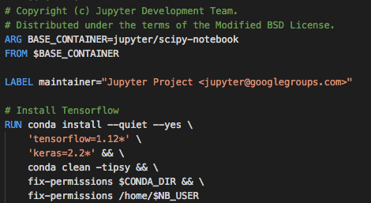

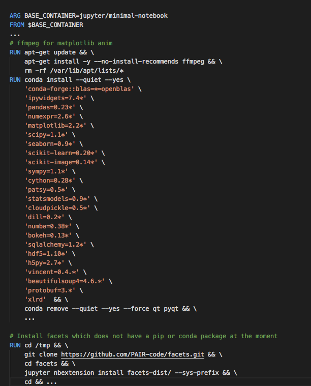

---

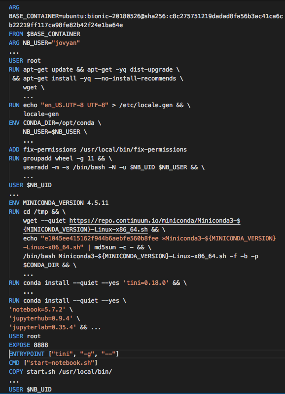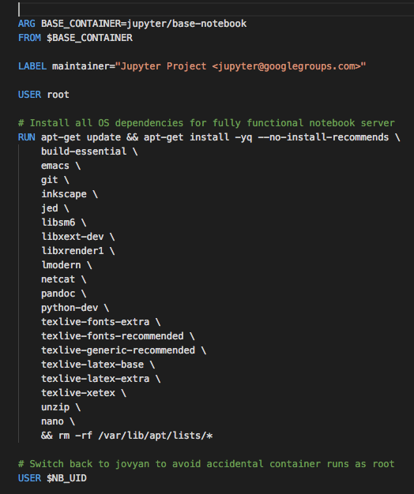

---


## repo2docker and binder

- building docker images is not dead simple
- the Jupyter folks created [repo2docker](https://repo2docker.readthedocs.io/en/latest/) for this.
- provide a github repo, and repo2docker makes a docker image and uploads it to the docker image repository for you
- [binder](http://mybinder.org) builds on this to provide a service where you provide a github repo, and it gives you a working jupyterhub where you can "publish" your project/demo/etc
- built repo's can be used with multiple software such as jupyterhub/dask/kubernetes, etc

---

## usage example: AM207 and thebe-lab

- see https://github.com/am207/shadowbinder , a repository with an environment file only
- this repo is used to build a jupyterlab with some requirements where you can work. 
- see [here](http://am207.info/wiki/doseplacebo.html) for example
- uses [thebelab](https://github.com/minrk/thebelab)
- used in the [Spacy Course](http://course.spacy.io) as well

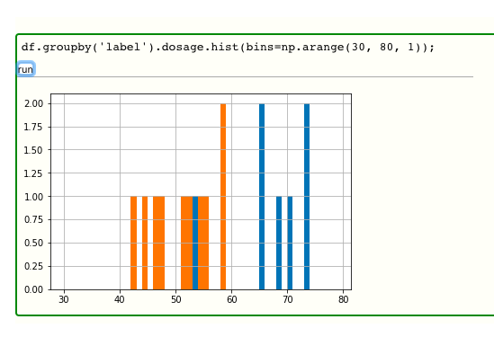

---

Ok, so you now got repeatable environments. We next need to be

##[fit] Running in parallel

and somehow manage all these machines...

---

## Running in parallel: Dask


- library for parallel computing in Python.
- 2 parts. Dynamic task scheduling optimized for computation like `Airflow`.  “Big Data” collections like parallel (numpy) arrays, (pandas) dataframes, and lists
- scales up (1000 core cluster) and down (laptop)
- designed with interactive computing in mind, with web based diagnostics

---


(from https://github.com/TomAugspurger/dask-tutorial-pycon-2018)

---

## dask pipelines: the good

```python
scores = []
for ngram_range in parameters['vect__ngram_range']:
        vect = CountVectorizer(ngram_range=ngram_range)
        X2 = vect.fit_transform(X, y)
        for norm in parameters['tfidf__norm']:
                tfidf = TfidfTransformer(norm=norm)
                X3 = tfidf.fit_transform(X2, y)
                for alpha in parameters['clf__alpha']:
                        clf = SGDClassifier(alpha=alpha)
                        clf.fit(X3, y)
                        scores.append(clf.score(X3, y))
best = choose_best_parameters(scores, parameters)
```


---


## Use Case 1: Hyperparameter optimization using dask

```python
from keras.models import Sequential
from keras.layers import Dense
from keras.wrappers.scikit_learn import KerasClassifier
from sklearn.datasets import load_breast_cancer
from sklearn.model_selection import train_test_split
from dask_ml.model_selection import GridSearchCV
from dask.distributed import Client
from sklearn.externals import joblib

def simple_nn(hidden_neurons):
  model = Sequential()
  model.add(Dense(hidden_neurons, activation='relu', input_dim=30))
  model.add(Dense(1, activation='sigmoid'))
  model.compile(loss='binary_crossentropy', optimizer='rmsprop', metrics=['accuracy'])
  return model

param_grid = {'hidden_neurons': [100, 200, 300]}
if __name__=='__main__':
	client = Client()
	cv = GridSearchCV(KerasClassifier(build_fn=simple_nn, epochs=30), param_grid)
	X, y = load_breast_cancer(return_X_y=True)
	X_train, X_test, y_train, y_test = train_test_split(X, y)
	with joblib.parallel_backend("dask", scatter=[X_train, y_train]):
		cv.fit(X_train, y_train)
	print(f'Best Accuracy for {cv.best_score_:.4} using {cv.best_params_}')
```

---

## Use case 2: Large Data Sets

- important for pre-processing, 
- also important for prediction on large data (test) sets
- dask provides scalable algoritms which can be run over clusters and are drop-in replacements for the `sklearn` equivalents
- Dask separates computation description (task graphs) from execution (schedulers). 
- Write code once, and run it locally or scale it out across a cluster.

---

```python
# Setup a local cluster.
import dask.array as da
import dask.delayed
from sklearn.datasets import make_blobs
import numpy as np
from dask_ml.cluster import KMeans


n_centers = 12
n_features = 20
X_small, y_small = make_blobs(n_samples=1000, centers=n_centers, n_features=n_features, random_state=
0)
centers = np.zeros((n_centers, n_features))
for i in range(n_centers):
    centers[i] = X_small[y_small == i].mean(0)
print(centers)

n_samples_per_block = 20000 # 0
n_blocks = 500
delayeds = [dask.delayed(make_blobs)(n_samples=n_samples_per_block,
                                     centers=centers,
                                     n_features=n_features,
                                     random_state=i)[0] for i in range(n_blocks)]
arrays = [da.from_delayed(obj, shape=(n_samples_per_block, n_features), dtype=X_small.dtype) for obj
in delayeds]
X = da.concatenate(arrays)
print(X.nbytes / 1e9)
X = X.persist() #actually run the stuff

clf = KMeans(init_max_iter=3, oversampling_factor=10)
clf.fit(X)
print(clf.labels_[:10].compute()) #actually run the stuff
```

---


```python
# run using local distributed scheduler
import dask.array as da
import dask.delayed
from sklearn.datasets import make_blobs
import numpy as np
from dask_ml.cluster import KMeans

n_centers = 12
n_features = 20
X_small, y_small = make_blobs(n_samples=1000, centers=n_centers, n_features=n_features, random_state=0)
centers = np.zeros((n_centers, n_features))
for i in range(n_centers):
    centers[i] = X_small[y_small == i].mean(0)
print(centers)

from dask.distributed import Client

# Setup a local cluster.
# By default this sets up 1 worker per core
if __name__=='__main__':
    client = Client()
    print(client.cluster)
    n_samples_per_block = 20000 # 0
    n_blocks = 500
    delayeds = [dask.delayed(make_blobs)(n_samples=n_samples_per_block,
                                        centers=centers,
                                        n_features=n_features,
                                        random_state=i)[0] for i in range(n_blocks)]
    arrays = [da.from_delayed(obj, shape=(n_samples_per_block, n_features), dtype=X_small.dtype) for obj in delayeds]
    X = da.concatenate(arrays)
    print(X.nbytes / 1e9)
    X = X.persist() #actually run the stuff

    clf = KMeans(init_max_iter=3, oversampling_factor=10)
    clf.fit(X)
    print(clf.labels_[:10].compute()) #actually run the stuff
```

---

- the previous code runs locally. ideally we want to run on a cloud-provisioned cluster
- and we'd like this cluster to be self-repairing
- and then we'd like our code to respond to failures.
- and expand onto more machines if we need them

We need a:

####[fit]cluster manager!

---

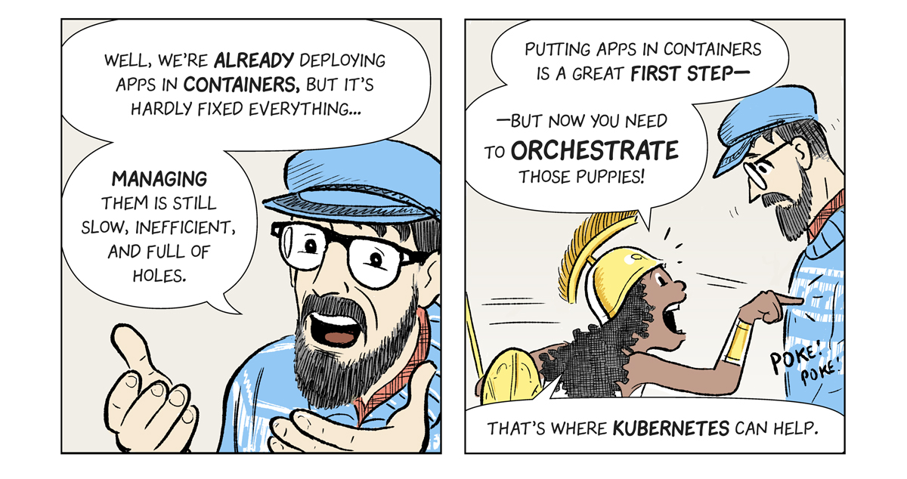

---

# Enter 
##[fit] Kubernetes

---

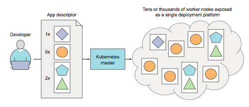

- OS for the cluster
- provides service discovery, scaling, load-balancing, self-healing, leader election
- think of applications as stateless, and movable from one machine to another to enable better resource utilization
- thus does not cover mutable databases which must remain outside the cluster
- there is a controlling master node, and worker nodes

---

## Kubernetes Goals

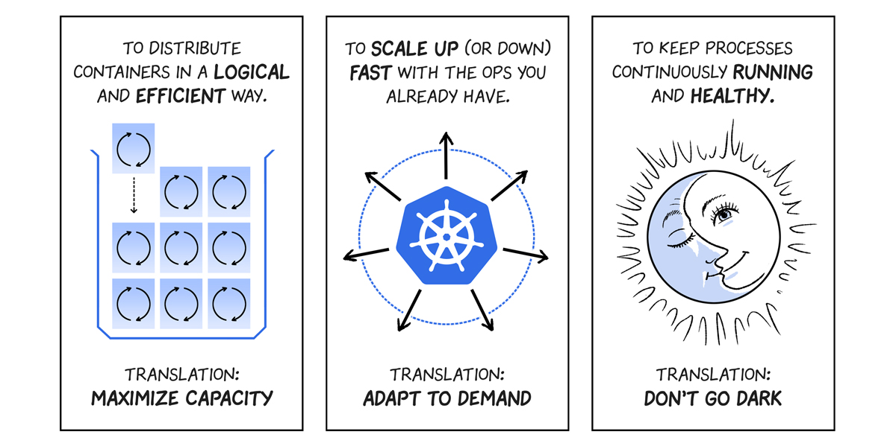

---

## Basic Structure

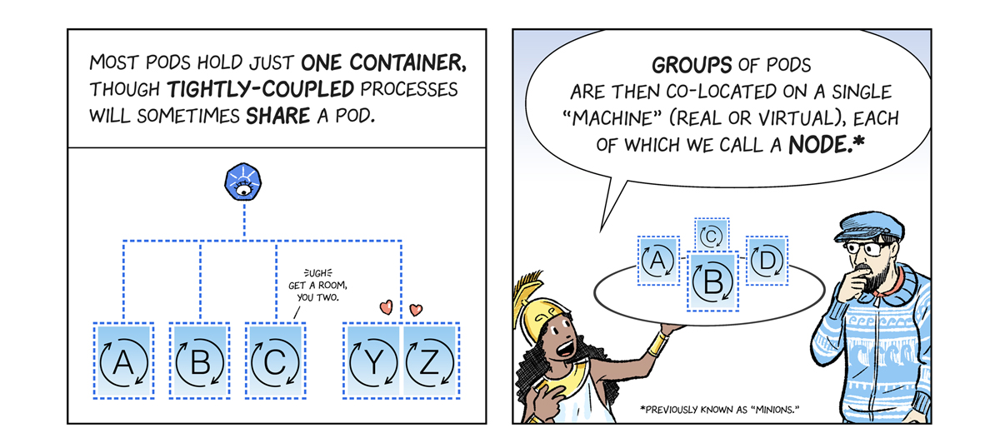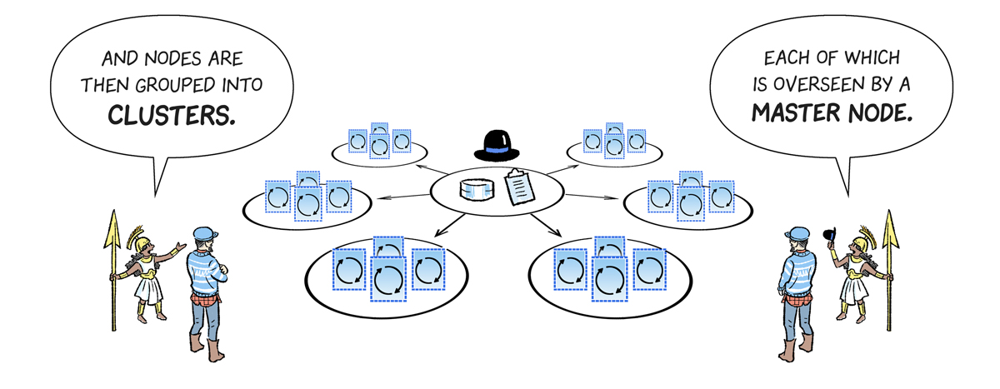

---

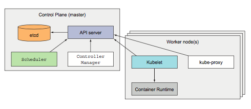

**master node**:

- API server, communicated with my control-plane components and you (using `kubectl`)
- Scheduler, assigns a worker node to each application
- Controller Manager, performs cluster-level functions, such as replicating components, keeping track of worker nodes, handling node failures
- etcd, a reliable distributed data store that persistently stores the cluster configuration.


---


**worker node**:

- Docker, to run your containers
- you package your apps components into 1 or more docker images, and push them to a registry
- Kubelet, which talks to the API server and manages containers on its node
- kube-proxy, which load-balances network traffic between application components

---

- To run an application in Kubernetes, you post a description of your app to the Kubernetes API server.
- people have created canned "descriptions" for multi-component software, which you can reuse. These use a "package manager" called `helm`, and its what is used to install dask and jupyterhub on a cluster
- description includes info on component images, their relationship, which ones need co-location, and how many replicas
- internal or external network services are also described. A lookup service is provided, and a given service is exposed at a particular ip address.  kube-proxy makes sure connec- tions to the service are load balanced 
- master continuously makes sure that the deployed state of the application matches description
  
---

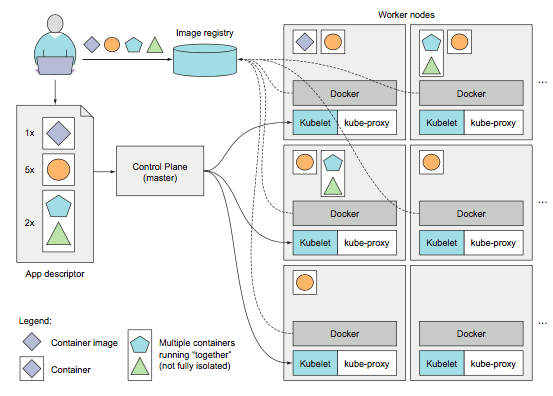

---

## Create a kubernetes cluster

---

## Deployment using `deployment.yaml`

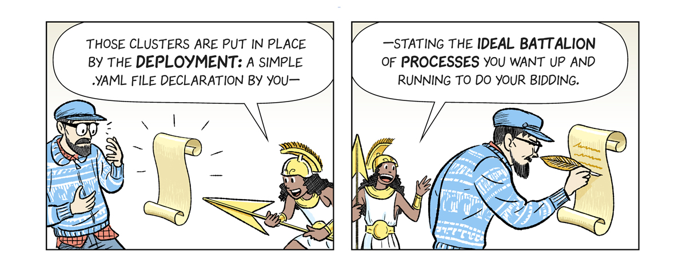

---

## Example: website with 3 replicas

Image: 

```Dockerfile
FROM nginx:stable-alpine
COPY  site/ /usr/share/nginx/html/
EXPOSE 80
```

Namespace:

```yaml
apiVersion: v1
kind: Namespace
metadata:
  name: website
```

`deployment.yaml` ->

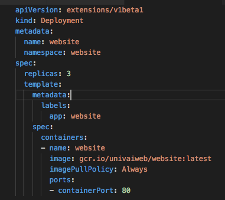

---

## From nodes to horizontal labels

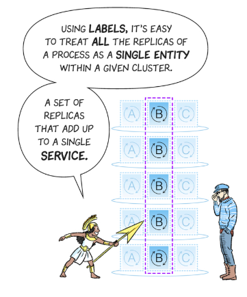

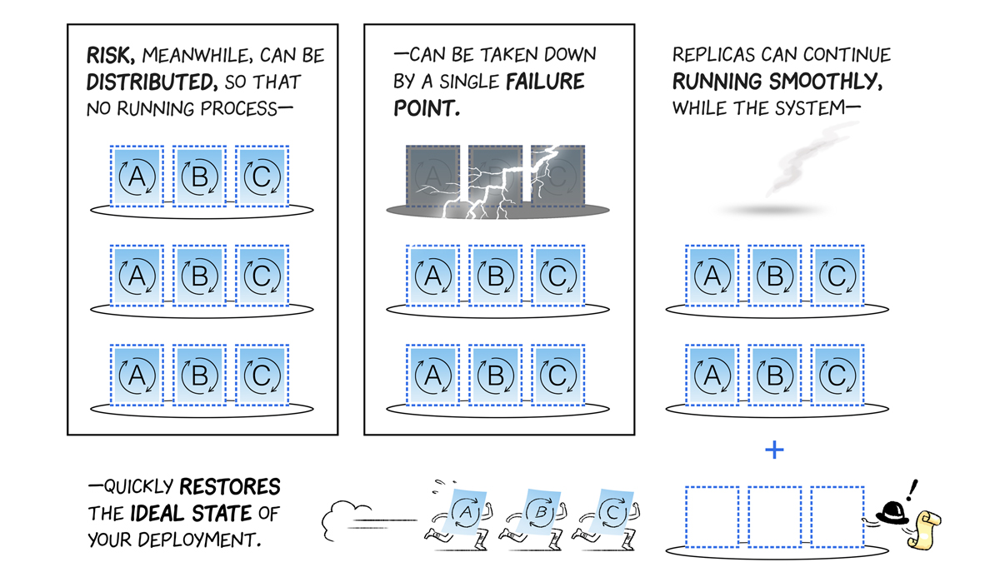

---

## Self Healing Deployments

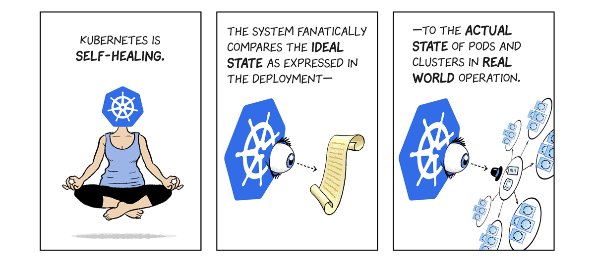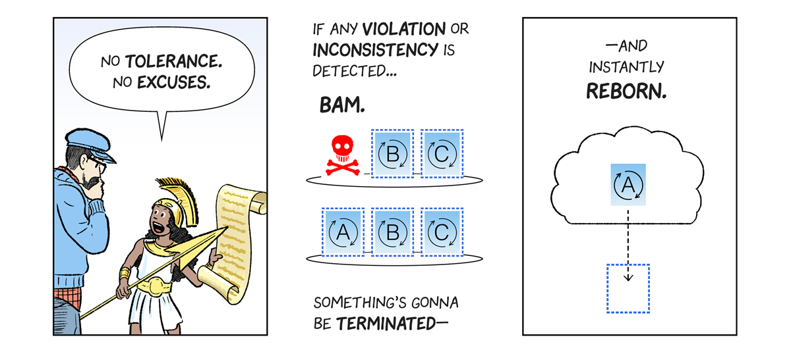

Used for deaths, consistency, and updating.

---

## Internal and External Networking

right: internal networking

below: external ingress

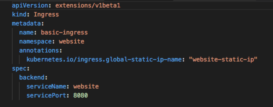 

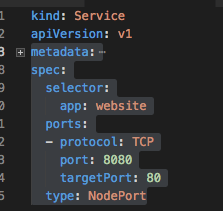

---

##Now, lets parallelize

- for data that fits into memory, we simply copy the memory to each node and run the algorithm there
- if you have created a re-sizable cluster of parallel machines, `dask` can even dynamically send parameter combinations to more and more machines
- see [PANGEO](https://pangeo.io/index.html)  for this 

##[fit] Dask can run on Kubernetes

---


## Dask cloud deployment

[Kubernetes is recommended](https://docs.dask.org/en/latest/setup/cloud.html)

This can be done on your local machine using [Minikube](https://kubernetes.io/docs/getting-started-guides/minikube/) or on any of the 3 major cloud prociders, Azure, GCP, or AWS.

1. [set up](https://zero-to-jupyterhub.readthedocs.io/en/v0.4-doc/create-k8s-cluster.html) a Kubernetes cluster
2. Next you will [set up Helm](https://zero-to-jupyterhub.readthedocs.io/en/v0.4-doc/setup-helm.html), which is a package maner for Kubernetes which works simply by filling templated yaml files with variables also stored in another yaml file `values.yaml`.
3. Finally you will install dask. First `helm repo update` and then `helm install stable/dask`. 

See https://docs.dask.org/en/latest/setup/kubernetes-helm.html for all the details.

---

## Deep Learning on the cloud

- tensorflow can be put on the cloud using `tf.distributed` of `kubeflow`
- parallelism can be trivially used at prediction time--you just need to distribute your weights
- as in our keras example you might have grid optimization
- but it would seem SGD is sequential

---

## Data parallel vs compute parallel

- **Data Parallel**: split a batch over multiple gpus on one machine or multiple gpus
- use horovod or kubeflow
- **Program Parallel**: like hyperparameter optimization
- Train entire model asynchronously using parameter servers. use `tf.distributed` or kubeflow.

---

## Data Parallel


- use the same model for every thread, but feed it with different parts of the data
- 4 GPUs,  you split a mini-batch with 128 examples into 32 examples for each GPU
- obtain gradients for each split batch, then average them
- problem: in backward pass you have to pass the whole gradient to ALL other GPUs. Thus use max-pool or other where params are less..conv layers
- cuBLAS: dont go below a batch size of 64 for each GPU
- 
  
---

## Model small batch sizes vs large batch sizes

---

## Model Parallel


- supports large models. thus better for fully connected layers
- might be really important in future for unsupervised learning
- synchronization needed after each dot product with the weight matrix for both forward and backward pass.
- See [Alex Krizhevsky](http://arxiv.org/pdf/1404.5997v2), uses data parallelism in the convolutional layers and model parallelism in the dense layers.

---