# Introduction to Kubernetes on Google Kubernetes Engine

In this section of the tutorial, we will go over steps to deploy Kubernetes clusters
on the Google Cloud Platform (GCP). Before we begin, please set up an account with GCP.

## Kubernetes Deployment Options

There are several options when deploying Kubernetes clusters.

Local / Development:

- [Minikube](https://kubernetes.io/docs/setup/minikube/)

While Minikube is helpful for development and experimentation, you would use one of
many cloud computing providers.

Cloud / Production:

- [Google Kubernetes Engine (GKE)](https://cloud.google.com/kubernetes-engine/)

- [Amazon Elastic Container Service for Kubernetes (EKS)](https://aws.amazon.com/eks/)

- [Microsoft Azure Container Service (AKS)](https://azure.microsoft.com/en-us/services/kubernetes-service/)

We will be using Google Kubernetes Engine in this tutorial. There are two reasons for
this choice:

1. Google created Kubernetes and was the first to provide Kubernetes platform (GKE) as IaaS.

2. GKE has the most thorough documentation (this can change in the near future).

---

## Create a New Project for Google Cloud

GCP projects are the basis for using all GCP services including management of API's, security, collaborators, billing, etc. Therefore, the firsts step in using GCP resources is to create a new project.

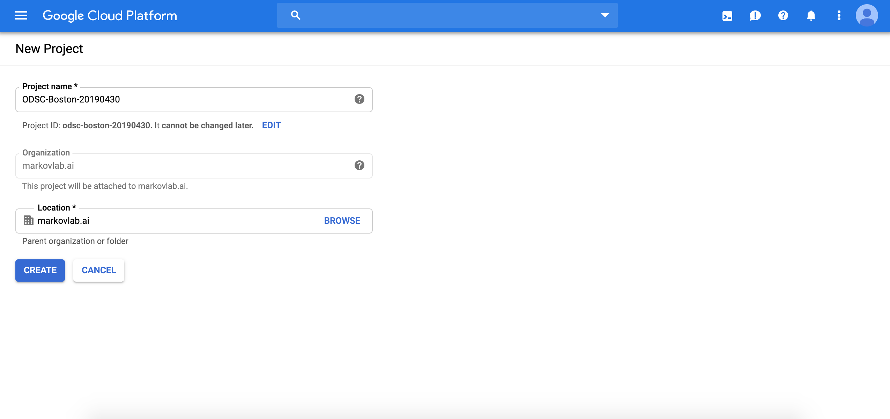

Define your project name and click "create". For instance, I am creating a project called
"ODSC-Boston-20190430."

Initializing a new project will take 1-2 minutes. Once your project has been created,
make sure the Cloud Console is set to the new project.

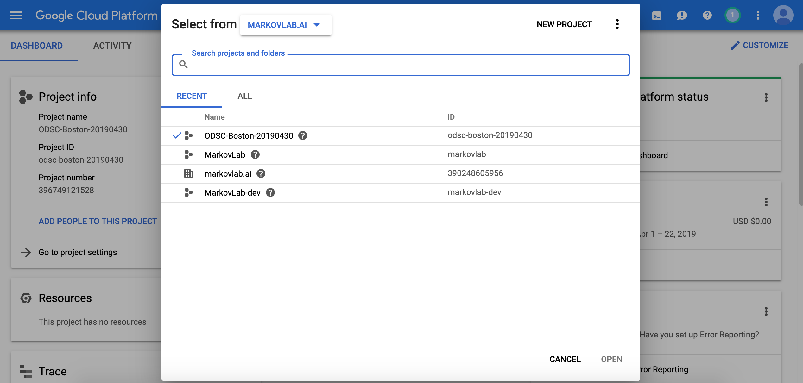

_If you have never used Google Cloud before, you will need set up a billing account, which will require your credit card information._

---

## 2. Enable API's

GKE API is not automatically enabled when you create your project. You need to enable
GKE API as well as well a few other API's for this tutorial.

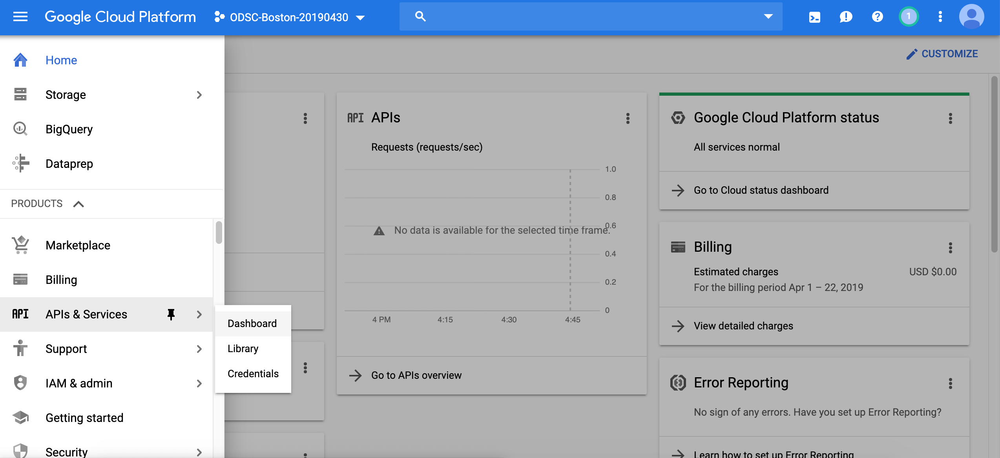

Click on the navigation menu button located in the upper-left corner next to the
GCP logo. This will open the navigation menu. Scroll down to "APIs & Services" and select
"Dashboard."

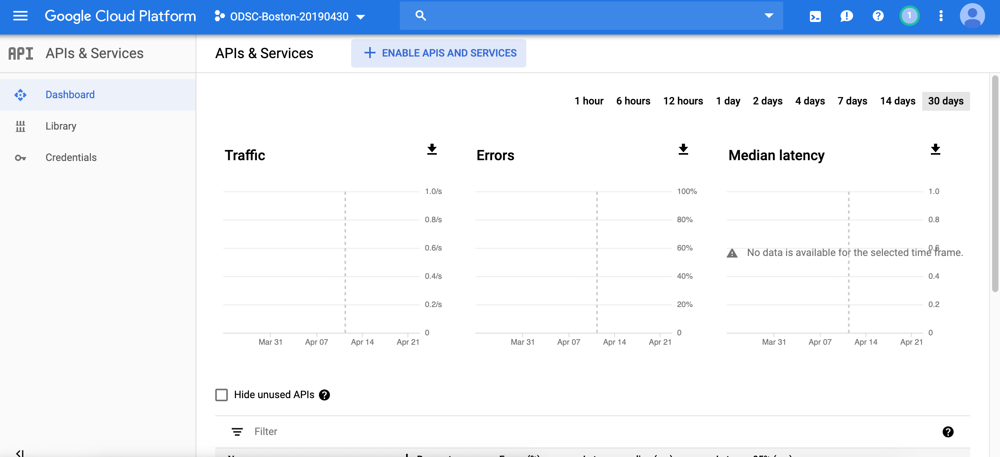

In the Dashboard page, click on "+ ENABLE APIS AND SERVICES" at the top.

In the API Library, search for "Kubernetes Engine API".

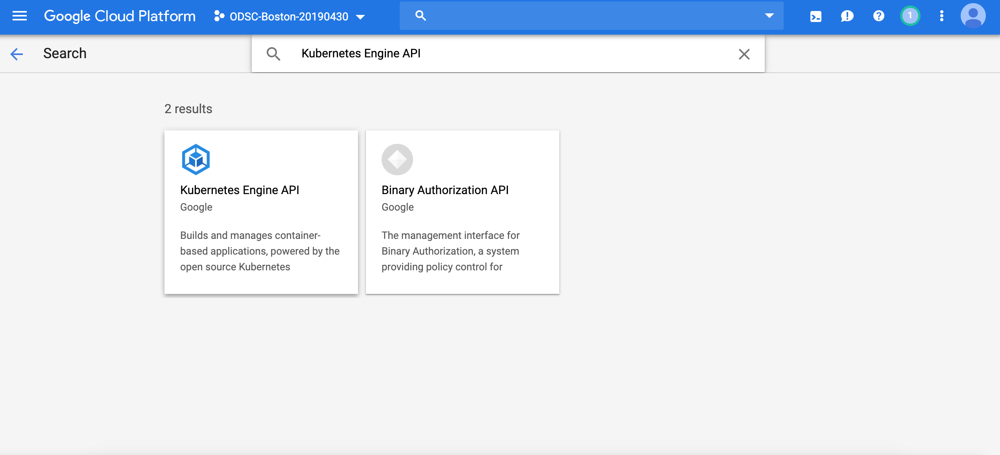

In the Kubernetes Engine API page, click "Enable" to activate GKE. This activation step can take 2-3 minutes.

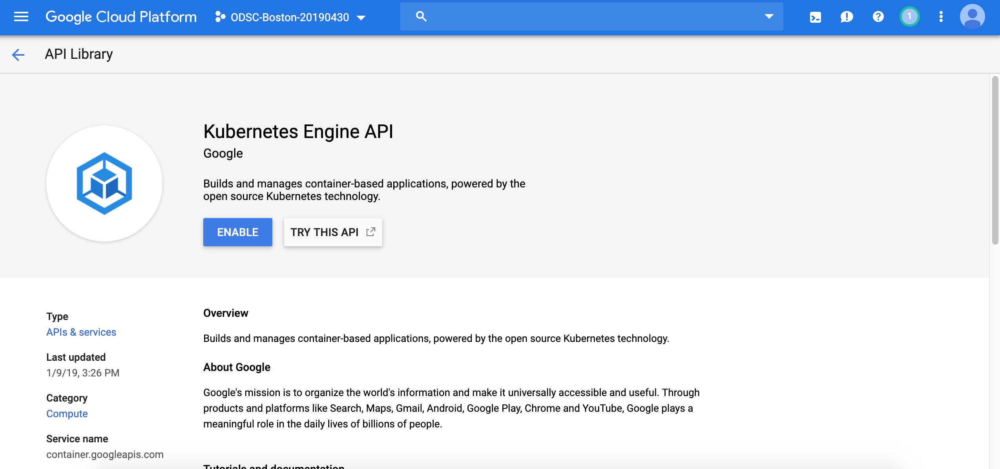

In addition to Kubernetes Engine, search for the following two API's and enable them
if they aren't already enabled.

- Identity and Access Management (IAM) API
- Deployment Manager API

---

## Creating Kubernetes cluster

You have two options for creating Kubernetes cluster on GCP:

- Google Cloud Console (Web UI)
- Google Cloud Shell (Bash command)

Here, we will use Cloud Console to get an intuitive understanding of creating a
Kubernetes cluster. Later in the tutorial, we will use a command line in Cloud Shell.

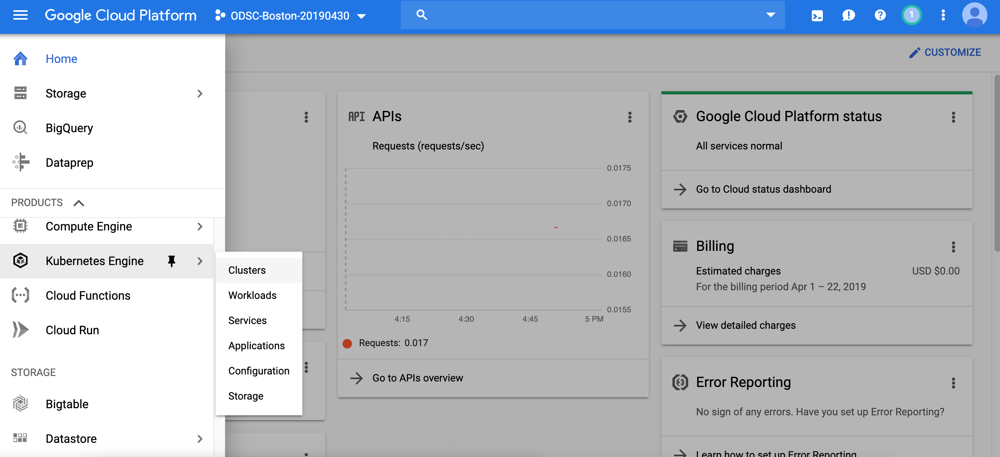

Open the navigation menu and scroll down to find "Kubernetes Engine" and select "Clusters."

If you do not have existing Kubernetes clusters, you will see the following:

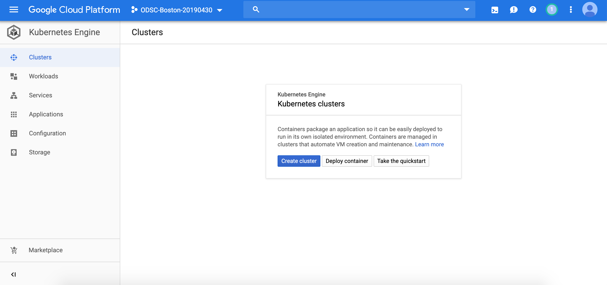

Click "Create cluster".

We will name the the new cluster "website," and leave the Zone setting to "us-central1-a" and
Master version to the default setting.

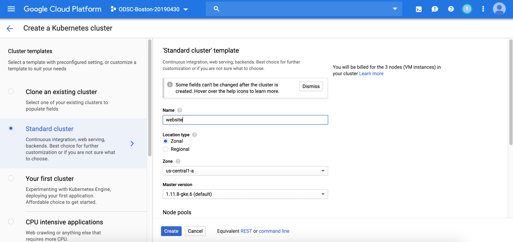

When selecting a zone for your cluster, you should look at the [documentation](https://cloud.google.com/compute/docs/regions-zones/) to check that the zone has computing resources that you need. For instance, "us-west1-c" does not provide GPUs. In addition, costs may vary slightly across different zones; therefore, take this into consideration when selecting your zone. For this tutorial, we will stick with the default zone setting of "us-central1-a".

Scroll down to the Node pools section. Leave the Number of nodes to 3, and select small (g1-small) for Machine type. Shared virtual CPU with 1.7 GB memory will be more than enough computing resource for this example; however, for larger projects that require more intensive computing and memory resources, you should consider using more a scalable machine type or even customizing to the need of your project. With custom machine type, you may be able to save as much as 40% in cost. However, this customizing machine type is beyond the scope of this tutorial.

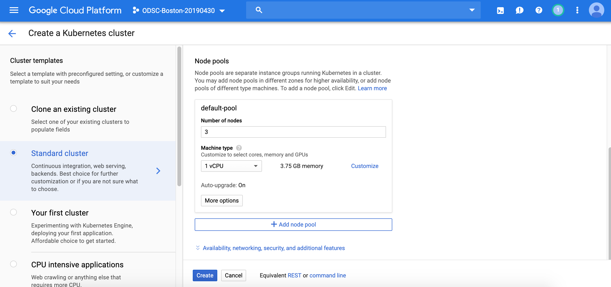

Click "Create," and it will take approximately 3-4 minutes to create the cluster.

We will use more scalable machine type later in this tutorial and demonstrate how
to change machine type and as well as the number of nodes after the cluster has been
deployed.

| Machine type   | vCPU | Memory | Price(USD) | Preemptible Price (USD) |
| -------------- | ---- | ------ | ---------- | ----------------------- |
| n1-standard-1  | 1    | 3.75GB | \$0.0475   | \$0.0100                |
| n1-standard-2  | 2    | 7.5GB  | \$0.0950   | \$0.0200                |
| n1-standard-4  | 4    | 15GB   | \$0.1900   | \$0.0400                |
| n1-standard-8  | 8    | 30GB   | \$0.3800   | \$0.0800                |
| n1-standard-16 | 16   | 60GB   | \$0.7600   | \$0.1600                |
| n1-standard-32 | 32   | 120GB  | \$1.5200   | \$0.3200                |
| n1-standard-64 | 64   | 240GB  | \$3.0400   | \$0.6400                |
| n1-standard-96 | 96   | 480GB  | \$4.5600   | \$0.9600                |

For more information about machine types and their pricing, check out the
[GCP documentation](https://cloud.google.com/compute/pricing).

---

## Deploying applications on the cluster

When the cluster is created, you will see it listed in the Cluster page of GKE. After creating a Kubernetes cluster, we will use Cloud Shell to deploy an app.

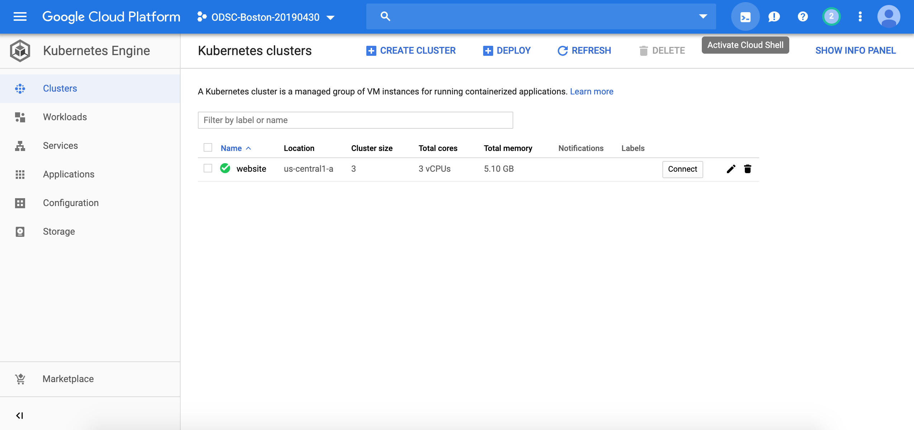

In the upper-right corner of the navigation bar, click on the icon to "Activate Cloud Shell."

This will open up the cloud shell on the bottom half of the screen.

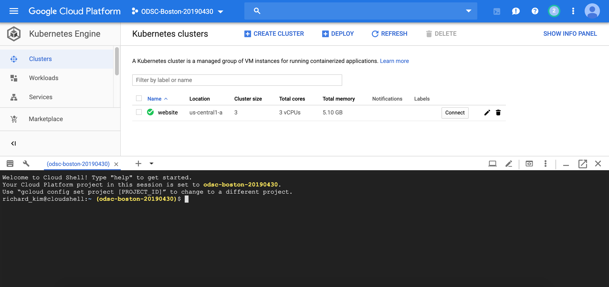

Cloud Shell provides command-line access to Google's cloud infrastructure from your browser
via Cloud SDK gcloud command-line tool and other utilities.

First, you must authorize the cloud shell to access the Kubernetes cluster that you created by
running the following command in the cloud shell:

`$ gcloud container clusters get-credentials <cluster name> --zone <cluster zone> --project <project id>`

Remember that `<cluster name>` is `website`.

---

## Writing Deployment and Services config files

Clone the following repository that we created for this tutorial by running the following command in the Cloud Shell:

`$ git clone https://github.com/rahuldave/ODSCe19-epp.git`

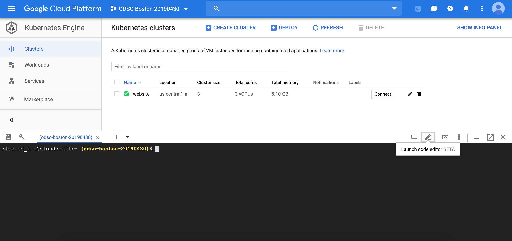

We will use code editor provided by GCP to read and modify configuration files. In the upper-right corner of the Cloud Shell, click on the pen icon to launch the code editor. This will open up the code editor in a new tab in your browser.

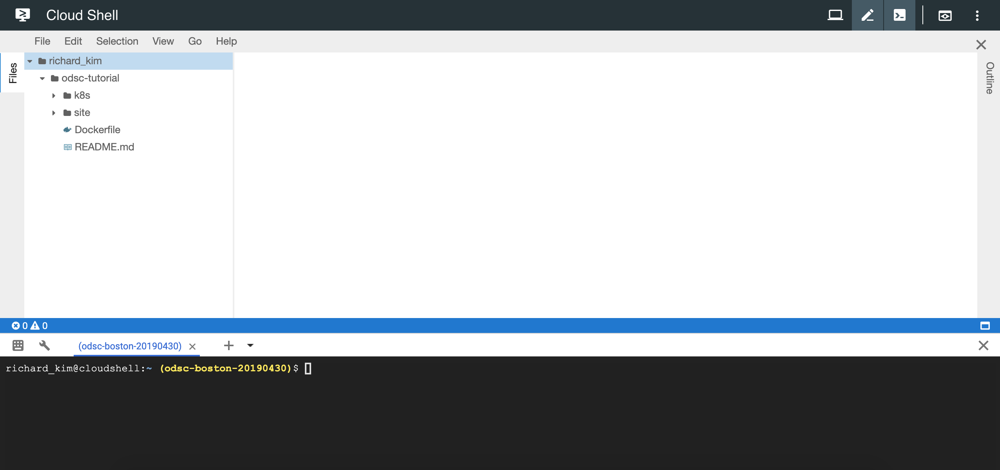

In the `web_material/k8s` directory, look for `deployment.yaml` file. It should contain the following specification:

```yaml
apiVersion: extensions/v1beta1
kind: Deployment
metadata:
  name: website
spec:
  replicas: 3
  template:
    metadata:
      labels:
        app: website
    spec:
      containers:
        - name: website
          image: nginx:alpine
          ports:
            - containerPort: 80
```

This configuration specifies Kubernetes to create a Deployment with the name of website. This Deployment will have 3 pods that each has a nginx container with a containerPort of 80. Create the deployment workload by running the following command in the Cloud Shell:

`$ kubectl apply -f web_material/k8s/deployment.yaml`

This will immediate create 3 pods, which you can verify by running:

`$ kubectl get pods`

For more detailed description of the pods, try:

`$ kubectl describe pods`

You can also see the deployment in the Workloads page.

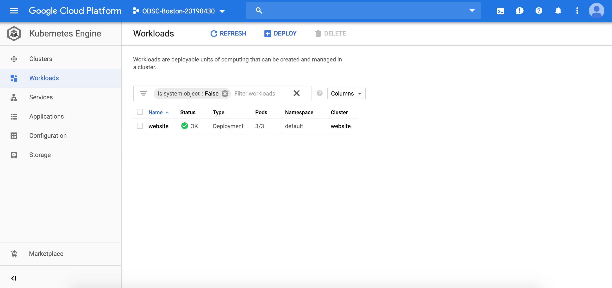

---

## Connecting the pods through services

Try the following command again:

`$ kubectl describe pods`

Scroll through the output and look for an IP address of one of the pods. Copy this IP address

and run the following command in the Cloud Shell:

`$ curl <ip address>`

You will find that the command hangs and that you cannot access the app inside a pod. What's going on?

Every pod that Kubernetes create is assigned a unique IP address; however, this IP is used to communicate between pods in Kubernetes cluster. Therefore, you cannot use the IP addresses of the pods to directly interact with the pods. This is where Kubernetes Services come in.

Services are abstractions which defines policies by which pods communicate within a Kubernetes cluster and outside network to access them.

Currently, there are four types of Services.

ClusterIP - Exposes a set of pods to other objects in the cluster
NodePort - Exposes a container to the outside world
LoadBalancer - Exposes the service externally using a cloud provider’s load balancer
Ingress - Manages external access to the services in a cluster via HTTP(S)

We will not cover all of the Services here in this tutorial.

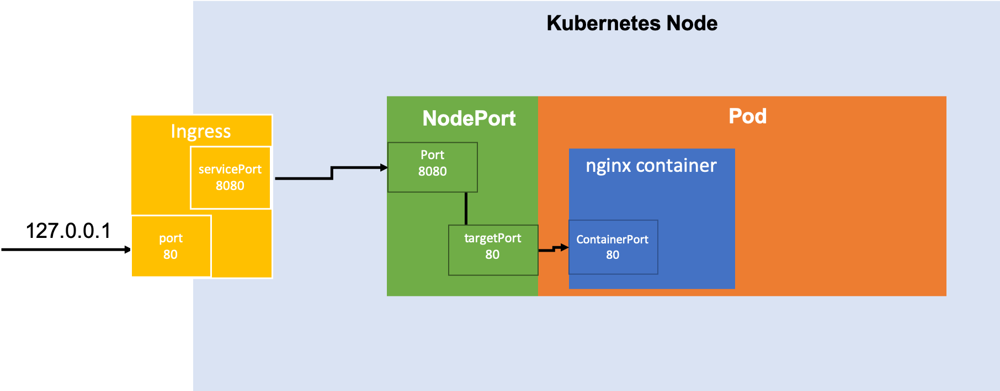

Figure above demonstrates how two services - NodePort and Ingress - enable outside
network to communicate with Pods and access the container inside them.

Take a look at the file "web_material/k8s/service.yaml".

```yaml
kind: Service
apiVersion: v1
metadata:
  name: website-service
  annotations:
    ingress.kubernetes.io/target-proxy: https-target
spec:
  selector:
    app: website
  ports:
    - protocol: TCP
      port: 8080
      targetPort: 80
  type: NodePort
```

The configuration file for NodePort Service defines targetPort to be 80, which will be the port that connects the service to the website pods. NodePort itself is connected to the outside network via port 8080 through TCP protocol.

Also note the "selector" configration with "app: website", which matches the metadata information for replicas in the deployment configuration. "labels" in the deployment.yaml file must match the "selector" in service.yaml. This information is how NodePort object identifies the appropriate pods to connect with the outside world.

Create NodePort service by running the following command in Cloud Shell:

`$ kubectl apply -f web_material/k8s/service.yaml`

Next, we create Ingress. In GKE, Ingress defines policies for routing external HTTP(S) traffic to applications running in a Kubernetes cluster.

Before we create an Ingress object, we will create a static IP for the Ingress object .

`$ gcloud compute addresses create web-static-ip --global`

This command will create a static IP address for our application.

Look into the file "web_material/k8s/ingress.yaml".

```yaml
apiVersion: extensions/v1beta1
kind: Ingress
metadata:
  name: basic-ingress
  annotations:
    kubernetes.io/ingress.global-static-ip-name: web-static-ip
spec:
  backend:
    serviceName: website-service
    servicePort: 8080
```

Note that "serviceName" of "backend" matches that of NodePort service name and the "servicePort" also matches the "port" of NodePort service. This information defines the policy that connects Ingress and NodePorts.

Create an Ingress object by running:

`$ kubectl apply -f web_material/k8s/ingress.yaml`

This step will take several minutes to complete.

---

## Check for successful deployment

Run the following command in the Cloud Shell:

`$ kubectl get ingress`

If the Ingress object has been successfully created, output of this command will contain the IP address of the Ingress object. Open a new window in your browser and visit the IP address assigned to the
Ingress service. If there are no errors, you will see the standard nginx start page:

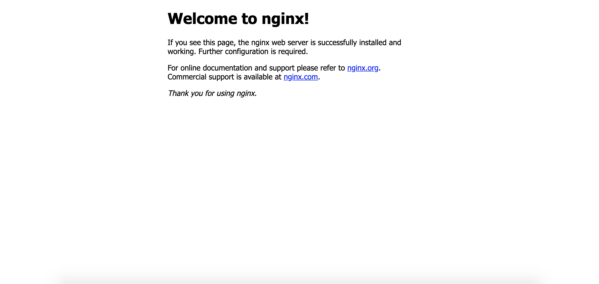

---

## Modifying Kubernetes application after deployment

How do we modify the application after it has been deployed? While the steps we took to deploy Kubernetes cluster, pods, and services are onerous, this is where the benefits gained from using container technology and microservices are realized.

Let's update the pods with a new image. Take a look at the Dockerfile in the root directory of the project.

```Docker
FROM nginx:alpine
COPY  site/ /usr/share/nginx/html/
EXPOSE 80
```

You will create a new Docker image by running the following command.

`$ docker build -t gcr.io/<project-name>/<image>:<tag> .`

Don't forget to include '.' at the end of the command. Tag the new image for Google Container Registry (GCR), which is Google's version of Docker Hub for storing images.

Push the image to GCR.

`$ docker push gcr.io/<project-name>/<image>:<tag>`

_If Google Container Registry API isn't enabled in Cloud Shell, you need to do this
via step similar to one that we took earlier in the tutorial to enable GKE._

---

## Updating Deployment

In `deployment.yaml`, modify the `image` of the container template with the image that you pushed to GCR.

```yaml
apiVersion: extensions/v1beta1
kind: Deployment
metadata:
  name: website
spec:
  replicas: 3
  template:
    metadata:
      labels:
        app: website
    spec:
      containers:
        - name: website
          image: gcr.io/<project-name>/<image>:<tag>
          ports:
            - containerPort: 80
```

Back in the Cloud Shell, execute the following command in the project root directory.

`$ kubectl apply -f web_material/k8s/deployment.yaml`

This will update the pods with the new image, and if the update were successful, you should
see the following page when you visit the static IP address:

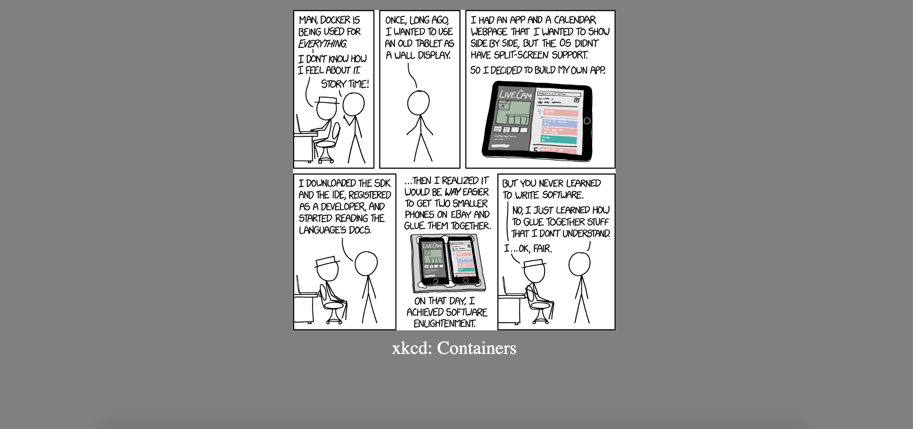

Without going through complex steps of provisioning new compute node and IP configuration, we are able to seemlessly update existing application. Consider more sophisticated application that involves hundreds of different images being served in several dozens of nodes. Without Kubernetes, small updates to a application requires re-deploying the entire application, which can be slow and prone to failures. With Kubernetes, you add, delete, or modify pods that are relevant to the updates.

---

## Cleaning Up

Google will charge you computing and storage resources used by GKE and other API's. Therefore, it's important to take steps to clean up after a project.

In the Cloud Shell, run:

`$ gcloud container clusters delete website --zone us-central1-a`

This will delete our Kubernetes cluster and delete all pods and services within it.

Additionally, let's delete the static IP we created for the website.

`$ gcloud compute addresses delete web-static-ip --global`

Finally, delete the Docker image saved in the Container Registry.

`$ gcloud container images delete gcr.io/<project-name>/<image>:<tag> --force-delete-tags`

---

## Resources

There are many online resources to learn more about Kubernetes. Here are a few:

- [Kubernetes Documentation](https://kubernetes.io/docs/home/)

- [Google Kubernetes Engine Documentation](https://cloud.google.com/kubernetes-engine/docs/)

- [Katacoda](https://www.katacoda.com/courses/kubernetes) - Free online course on Kubernetes
